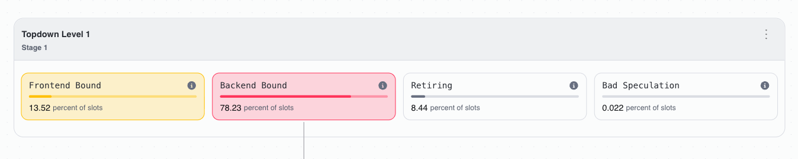
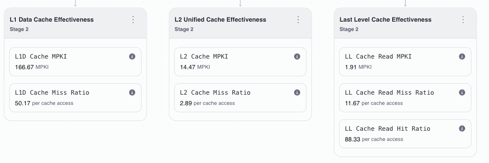
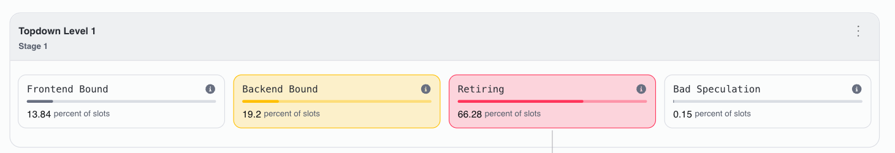
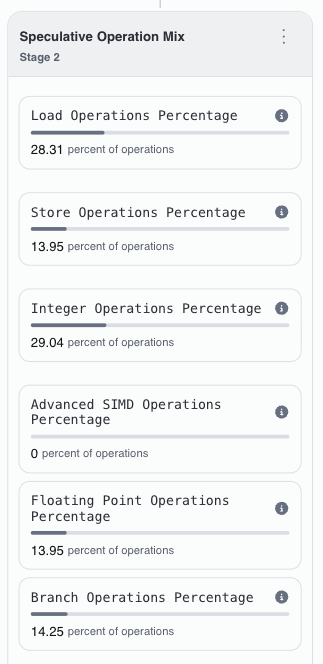
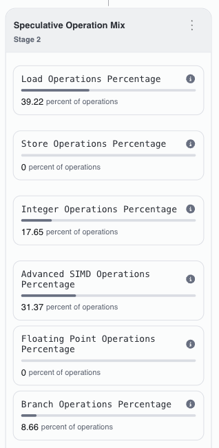

# Tutorial 1: Top-Down Performance Analysis Methodology

In this tutorial you will learn to use **Arm Total Performance (ATP)** to diagnose and fix performance bottlenecks in a C++ workload. The example workload is a dense matrix multiplication kernel, but the methodology applies to any compute-intensive code.

You will work through ATP's core diagnostic loop three times — **profile → diagnose → fix → re-profile** — learning to read a different part of the ATP interface at each step:

1. **Run the Topdown recipe** and read the Summary view to identify the bottleneck category.
2. **Drill into cache effectiveness** in the Functions tab to find which cache level is responsible.
3. **Check the Speculative Operation Mix** in the Retiring breakdown to assess SIMD utilisation.

By the end you will be comfortable using ATP's Topdown recipe to guide optimisation decisions on Graviton.

**Prerequisites:** AWS Graviton 2/3 instance, C++ compiler (g++ 9+ or clang++ 14+), CMake 3.16+, ATP installed and configured.

---

## Background: What the Top-Down View Shows You

Before opening ATP, it helps to understand what the numbers mean. You can skip this section and refer back to it as needed.

### The four buckets

Each cycle, the CPU has a fixed number of *slots* — the maximum micro-ops it can issue. ATP's Topdown recipe accounts for every slot in every cycle, placing each into one of four mutually exclusive categories:

| Category | What it means | What to do |
|---|---|---|
| **Retiring** | Slots doing useful work — higher is better | Check the instruction mix — are you using SIMD? |
| **Frontend Bound** | Frontend can't supply micro-ops fast enough | Look at I-cache misses, branch MPKI |
| **Backend Bound** | Backend stalled on data or execution units | Drill into Memory Bound vs Core Bound |
| **Bad Speculation** | Slots wasted on wrong-path instructions | Check branch misprediction ratio |

### The drill-down hierarchy

The power of Top-Down is that you never guess — you follow the dominant bucket downward:

```
Topdown
├── Frontend Bound  → I-cache MPKI, ITLB walks, branch MPKI
├── Backend Bound   → Memory Bound (L1 / L2 / LLC / DRAM) or Core Bound
├── Bad Speculation → branch misprediction ratio
└── Retiring        → instruction mix (scalar vs SIMD, integer vs FP)
```

If Backend Bound dominates, drill into Memory Bound vs Core Bound. If Memory Bound, look at which cache level is missing. That tells you exactly what to fix.

### ATP's recipes — when to use which

ATP provides several recipes. They are complementary:

| Recipe | Question it answers | When to use |
|---|---|---|
| **CPU Cycle Hotspots** | *Where* is time spent? | First — find your hot functions |
| **Topdown** | *Why* is that function slow? | Second — diagnose the bottleneck category |
| **Memory Access** | Which cache level is stalling me? | Confirm a memory-bound diagnosis (uses SPE) |
| **Instruction Mix** | Is my code actually vectorised? | Verify SIMD usage after optimisation |

This tutorial focuses on the **Topdown** recipe, which surfaces enough information to guide each optimisation step.

> **Note on measurement bias:** ATP's sampling reports Retiring slightly low and Frontend/Bad Speculation slightly high. Use values for **relative comparison between runs**, not as absolute ground truth.

---

## 1. Build the Code

```bash
cd tutorial_1
mkdir -p build && cd build
cmake ..
make -j$(nproc)
```

This produces three executables — `matmul_naive`, `matmul_tiled`, and `matmul_neon` — which compute the same result (`C = A × B`, default 512×8192 × 8192×8192). You can pass custom dimensions as `./matmul_naive M K N`.

---

## 2. Profile the Baseline — Learning the Topdown Summary View

Run the naive implementation to get a baseline timing:

```bash
./matmul_naive
```

The naive kernel is a textbook three-loop matrix multiply. Its inner loop accesses B with a stride of N elements:

```cpp
for (int k = 0; k < K; ++k)
    sum += A[i * K + k] * B[k * N + j]; // B strides by N per iteration
```

We suspect this is slow, but *why*? This is where ATP comes in.

### Step 1 — Run the Topdown recipe

Open ATP and select **Recipes → Topdown**. Choose the `matmul_naive` executable as the target:


ATP will collect hardware performance counter data for approximately 30 seconds. When it finishes, it opens the **Summary** view automatically.

### Step 2 — Read the Summary view



Look at the four top-level bars. **Backend Bound** dominates at roughly 70%. This tells you:

- The frontend is supplying micro-ops adequately (Frontend Bound is not the issue).
- The backend cannot execute them fast enough — it is stalled.
- Retiring is low (~15%), meaning most of the CPU's capacity is wasted waiting.

**Your diagnosis so far:** The bottleneck is in the backend. But *what* in the backend? Memory latency? Execution unit contention? You need to drill down.

### Step 3 — Drill into cache effectiveness

Look below to the **Backend Summary Breakdown**. ATP shows cache effectiveness metrics for this function:



Read the miss ratios at each cache level:

| Cache level | Miss ratio | What it tells you |
|---|---|---|
| L1D | ~49% | Nearly half of all data loads miss L1 |
| L2 | ~24% | A quarter of L2 accesses also miss |
| LLC | **~61%** | Most LLC accesses miss — data comes from DRAM |

**The LLC miss ratio is the critical number.** A 61% miss rate at the last-level cache means the majority of memory requests must travel all the way to DRAM, costing hundreds of cycles per access. This is why Backend Bound is so high.

### Step 4 — Connect the diagnosis to the code

Now you know *what* the bottleneck is (LLC misses). Connect it to the source: the `B[k*N + j]` access strides by N = 8192 elements (32 KB) per k-iteration. The full B matrix is 256 MB — far exceeding the ~32 MB LLC. The hardware prefetcher cannot track these large strides.

**Complete diagnosis: Backend Bound → Memory Bound → LLC misses, caused by strided B access.**

This is the Top-Down workflow: **Summary → dominant bucket → drill down → connect to code.**

---

## 3. Fix and Re-Profile — 2D Tiling

The diagnosis says: keep the working set in cache. The standard fix is **2D tiling**: partition the loops so the inner computation works on sub-blocks that fit in L2.

The tiled kernel in `src/matmul_tiled.cpp` uses TILE=128. A 128×128 tile of floats is 64 KB; three tiles (A, B, C sub-blocks) total 192 KB, fitting comfortably in Graviton3's 1 MB L2 cache:

```cpp
constexpr int TILE = 128;

void matmul_tiled(const float* A, const float* B, float* C, int M, int K, int N) {
    std::memset(C, 0, M * N * sizeof(float));
    for (int i0 = 0; i0 < M; i0 += TILE)
      for (int j0 = 0; j0 < N; j0 += TILE) {
        int i_end = std::min(i0 + TILE, M);
        int j_end = std::min(j0 + TILE, N);
        for (int k0 = 0; k0 < K; k0 += TILE) {
            int k_end = std::min(k0 + TILE, K);
            for (int i = i0; i < i_end; ++i)
              for (int k = k0; k < k_end; ++k) {
                float a_ik = A[i * K + k];
                for (int j = j0; j < j_end; ++j)
                    C[i * N + j] += a_ik * B[k * N + j];
              }
        }
      }
}
```

### Re-profile: did it work?

Run the Topdown recipe again, this time on `matmul_tiled`. **Always re-profile after a change** — never assume your optimisation had the intended effect.



Compare the Summary view side-by-side with the naive run:

| Metric | Naive | Tiled | Reading |
|--------|-------|-------|---------|
| **Retiring** | ~15% | **66.5%** | Pipeline now doing useful work most of the time |
| **Backend Bound** | ~70% | **18.9%** | Memory stalls largely eliminated |

Now check cache effectiveness in the Functions tab:


| Cache | Naive | Tiled | Reading |
|-------|-------|-------|---------|
| L1D miss | ~49% | **2.4%** | Inner loop's ~1 KB working set fits in L1 |
| L2 miss | ~24% | **~0%** | Full 64 KB tile fits in L2 |
| LLC miss | ~61% | **~0%** | DRAM access eliminated |

The LLC bottleneck is gone. The diagnosis has shifted — **Retiring now dominates**, which means the pipeline is completing instructions efficiently. But is it completing the *right kind* of instructions?

### New diagnosis: check the instruction mix

With the memory bottleneck removed, drill into the **Retiring** category. Open the **Speculative Operation Mix** panel:



| Operation Type | % |
|---|---|
| Load | 28.3% |
| Store | 14.0% |
| Integer | 29.1% |
| Floating Point | 14.0% |
| **Advanced SIMD** | **0%** |

**Advanced SIMD is 0%.** Every multiply-add is a scalar operation processing one float at a time. Arm NEON can process 4 floats per instruction — we are leaving 4× throughput on the table.

**New diagnosis: Retiring is high but scalar-only. The bottleneck is now compute throughput, not memory.**

---

## 4. Fix and Re-Profile — NEON Register Blocking

The diagnosis says: vectorise the arithmetic. The NEON kernel in `src/matmul_neon.cpp` introduces two changes:

1. **4×4 register blocking** — a micro-kernel that holds a 4×4 sub-block of C in NEON registers, using `vfmaq_n_f32` to perform 4 multiply-adds per instruction.
2. **B-tile packing** — rearranges each B tile into contiguous memory so the micro-kernel reads B sequentially (all L1 hits) instead of striding by N.

The tile size is also reduced to TILE=64. Three 64×64 tiles = 48 KB, which fits in L1d (64 KB) rather than just L2. This is smaller because the NEON micro-kernel holds more data in registers:

```cpp
constexpr int TILE = 64;

static void pack_B_tile(const float* B, float* packed,
                        int k0, int k_end, int j0, int j_end, int N) {
    float* dst = packed;
    for (int j = j0; j < j_end; j += 4)
        for (int k = k0; k < k_end; ++k) {
            vst1q_f32(dst, vld1q_f32(&B[k * N + j]));
            dst += 4;
        }
}

void matmul_neon(const float* A, const float* B, float* C, int M, int K, int N) {
    std::memset(C, 0, M * N * sizeof(float));
    std::vector<float> packed_B(TILE * TILE);

    for (int i0 = 0; i0 < M; i0 += TILE)
      for (int j0 = 0; j0 < N; j0 += TILE)
        for (int k0 = 0; k0 < K; k0 += TILE) {
            int i_end = std::min(i0 + TILE, M), j_end = std::min(j0 + TILE, N);
            int k_end = std::min(k0 + TILE, K), k_len = k_end - k0;

            pack_B_tile(B, packed_B.data(), k0, k_end, j0, j_end, N);

            for (int i = i0; i < i_end; i += 4) {
                const float* bp = packed_B.data();
                for (int j = j0; j < j_end; j += 4) {
                    float32x4_t c0 = vld1q_f32(&C[(i+0)*N+j]);
                    float32x4_t c1 = vld1q_f32(&C[(i+1)*N+j]);
                    float32x4_t c2 = vld1q_f32(&C[(i+2)*N+j]);
                    float32x4_t c3 = vld1q_f32(&C[(i+3)*N+j]);

                    const float* bp_k = bp;
                    for (int k = k0; k < k_end; ++k) {
                        float32x4_t b = vld1q_f32(bp_k); bp_k += 4;
                        c0 = vfmaq_n_f32(c0, b, A[(i+0)*K+k]);
                        c1 = vfmaq_n_f32(c1, b, A[(i+1)*K+k]);
                        c2 = vfmaq_n_f32(c2, b, A[(i+2)*K+k]);
                        c3 = vfmaq_n_f32(c3, b, A[(i+3)*K+k]);
                    }

                    vst1q_f32(&C[(i+0)*N+j], c0);
                    vst1q_f32(&C[(i+1)*N+j], c1);
                    vst1q_f32(&C[(i+2)*N+j], c2);
                    vst1q_f32(&C[(i+3)*N+j], c3);
                    bp += k_len * 4;
                }
            }
        }
}
```

### Re-profile: is SIMD being used?

Run the Topdown recipe on `matmul_neon`. Go straight to the Speculative Operation Mix — that is what we need to verify:



| Operation Type | Tiled | NEON |
|---|---|---|
| Floating Point (scalar) | 14.0% | **0%** |
| **Advanced SIMD** | 0% | **31.6%** |

All arithmetic is now vectorised. Scalar floating-point dropped to 0% because every multiply-add is a NEON instruction processing 4 floats at once.

Each iteration of the inner k-loop now performs 4 vector FMAs (16 FLOPs) from ~5 memory operations — a much better compute-to-memory ratio than the scalar version.

---

## 5. The Full Picture

Run all three back-to-back and compare your ATP profiles:

```bash
./matmul_naive
./matmul_tiled
./matmul_neon
```

Here is how the ATP Topdown view evolved across the three optimisation steps:

| What ATP showed | Naive | Tiled | NEON |
|---|---|---|---|
| **Dominant bucket** | Backend Bound (~70%) | Retiring (~66%) | Retiring (high) |
| **Cache bottleneck** | LLC miss 61% | LLC miss ~0% | Data in L1 |
| **SIMD utilisation** | 0% | 0% | ~32% |

And the diagnostic workflow at each step:

| Step | ATP told us… | So we fixed… |
|---|---|---|
| 1 | Backend Bound → Memory Bound → LLC misses at 61% | Strided B access — applied 2D tiling to keep tiles in L2 |
| 2 | Retiring dominates but SIMD = 0% | Scalar arithmetic — applied NEON 4×4 micro-kernel |
| 3 | SIMD = 31.6%, Backend Bound minimal | Workload is now compute-efficient |

The key is that **ATP told us what to fix at each step**. We never guessed — the Topdown Summary pointed to the bottleneck category, and drilling into cache effectiveness or the operation mix told us exactly what to change.

---

## Key Takeaways

1. **Follow the Top-Down workflow**: Summary view → dominant bucket → drill down → connect to code → fix → re-profile. This is the loop you will use in every tutorial in this course.
2. **Backend Bound + high LLC miss ratio** → your working set doesn't fit in cache. Tile or restructure data access.
3. **High Retiring + 0% SIMD** → the pipeline is busy but scalar. Vectorise with NEON intrinsics.
4. **Always re-profile after each change.** ATP makes it easy to compare runs and confirm your optimisation addressed the right bottleneck.
5. **Use the right recipe for the question**: Topdown for diagnosis, CPU Cycle Hotspots for finding hot functions, Memory Access for detailed cache analysis, Instruction Mix for verifying vectorisation.