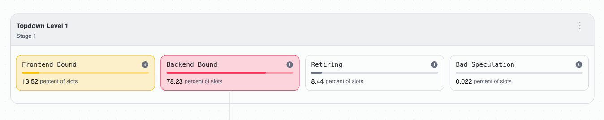
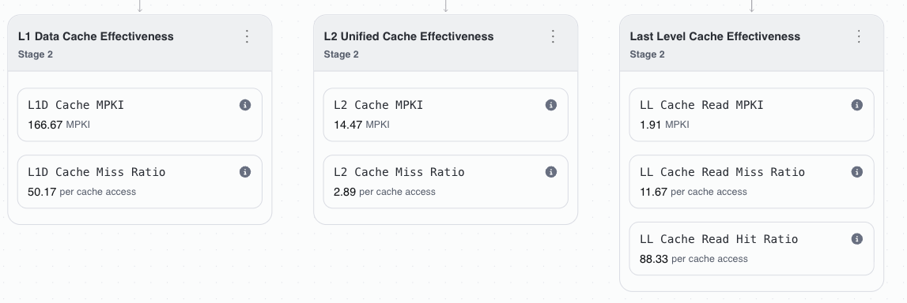
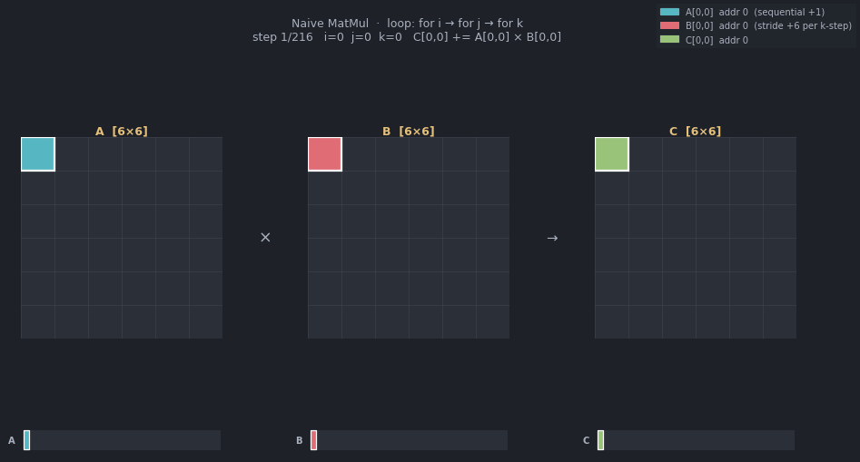
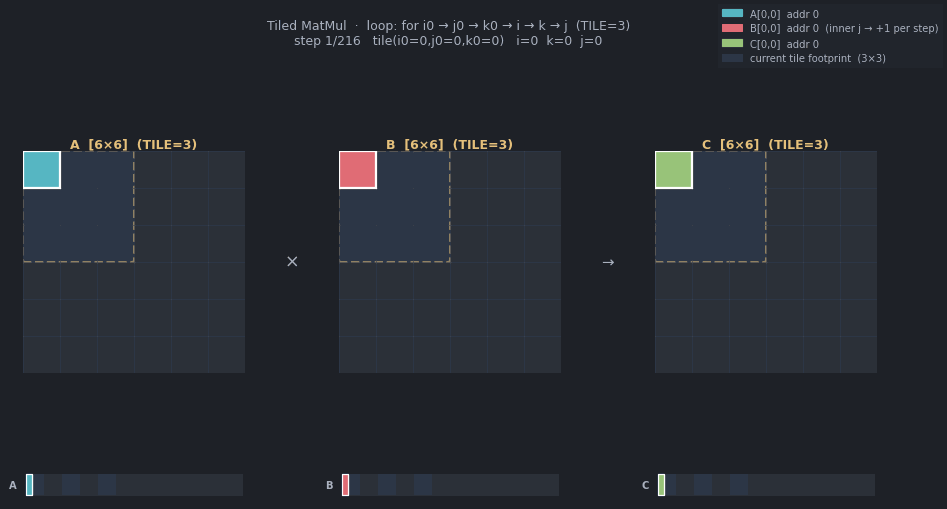
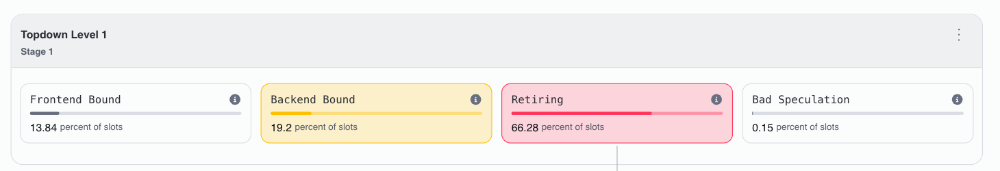
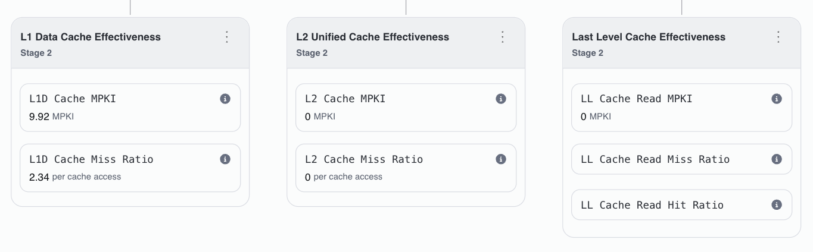
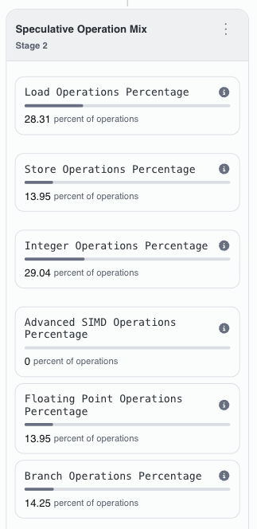
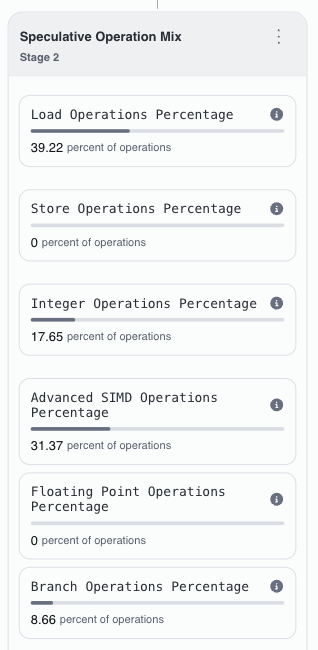

# Tutorial 1: Top-Down Performance Analysis with Arm-Total-Performance

Performance problems are rarely obvious from source code alone. A loop can look perfectly reasonable yet run far slower than expected, and without measurement it is easy to optimise the wrong thing. This tutorial shows you how to use **Arm Total Performance (ATP)** on **AWS Graviton** to identify bottlenecks systematically and verify that each fix actually works.

The example workload is dense matrix multiplication (`C = A x B`) in single-precision floating point. It is deliberately simple: the code is short and the algorithm is well known, which makes it easy to focus on what ATP is telling you at each step. The goal is not just to optimise this workload, but to learn a diagnostic method you can apply to any code.

You will work through three iterations of ATP's core optimisation loop: **profile, diagnose, fix, re-profile**. At each step, ATP identifies the dominant bottleneck, you apply a targeted fix, and ATP confirms whether the profile shifted as expected. By the end of this tutorial, you will know how to:

1. Read the ATP Topdown Summary view to identify the dominant bottleneck category.
2. Use cache effectiveness metrics in the Functions tab to determine which cache level is responsible.
3. Interpret the Speculative Operation Mix in the Retiring breakdown to assess SIMD utilisation.

## Before you begin

- An AWS Graviton 2/3 instance
- C++ compiler (g++ 9+ or clang++ 14+)
- CMake 3.16+
- ATP installed and configured

## Workload Definition: MatMul Operator

All three binaries in this tutorial implement the same row-major GEMM-like operator. Matrix `A` has shape `M x K`, matrix `B` has shape `K x N`, and the output `C` has shape `M x N`. Each element of C is computed as `C[i,j] = sum_{k=0..K-1} A[i,k] * B[k,j]`.

In flattened row-major memory, this is:

`C[i*N + j] += A[i*K + k] * B[k*N + j]`

The default problem size in this repo is `M=256, K=1024, N=8192`, and total floating-point work is approximately `2*M*K*N` FLOPs.

---

## Background: What the Top-Down View Shows You

Before opening ATP, it helps to understand what the numbers mean. You can skip this section and refer back to it as needed.

### The four buckets

The Topdown method starts from a simple idea: in every CPU cycle, the core has a limited opportunity to make progress. ATP models that opportunity as a set of *slots*. You can think of a slot as one place where a micro-op could have been issued.

ATP then accounts for every slot and asks what happened to it. Did it turn into useful work, sit idle because the frontend could not supply work, get held up in the backend, or get spent on speculative work that was later discarded? These outcomes are grouped into four mutually exclusive buckets.

**Retiring** represents slots used for instructions that complete and contribute to the final result. When Retiring is high, a larger share of the CPU's issue capacity is being converted into useful work.

**Frontend Bound** means the frontend is not supplying micro-ops quickly enough to keep the rest of the pipeline busy. In practical terms, the core could execute more work, but the instruction stream is not arriving fast enough.

**Backend Bound** means the work has made it past the frontend, but it cannot complete quickly enough in the backend. This usually means instructions are waiting on data, such as cache misses, or waiting for execution resources that are already busy.

**Bad Speculation** represents slots spent on work that does not contribute to the final result because it is later thrown away. A common example is the CPU following the wrong path after a branch prediction and then having to discard that speculative work.

### The narrowing hierarchy

A Top-Down analysis works by moving from broad categories to more specific ones. You begin with the bucket that accounts for the largest share of slots, then narrow the diagnosis to understand what sits underneath it:

```
Topdown
+-- Frontend Bound  -> I-cache MPKI, ITLB walks, branch MPKI
+-- Backend Bound   -> Memory Bound (L1 / L2 / LLC / DRAM) or Core Bound
+-- Bad Speculation -> branch misprediction ratio
+-- Retiring        -> instruction mix (scalar vs SIMD, integer vs FP)
```

For example, if **Backend Bound** is the largest bucket, the next question is whether those slots are being lost to the memory system or to pressure on the execution units. If the problem is memory-related, the next level helps you see whether the delays are mainly coming from L1, L2, LLC, or DRAM. Each step makes the diagnosis more specific and helps you choose a sensible optimisation direction.

### ATP's recipes and when to use them

The Topdown view is one way of looking at a program in ATP, not the only one. ATP provides several recipes that answer different performance questions, and they are often most useful when used together.

**CPU Cycle Hotspots** shows *where* the program is spending CPU time, so it is useful for identifying the functions worth investigating. **Topdown** shows *why* those functions are slow by breaking slots into the categories described above. **Memory Access** gives a more detailed view of memory behaviour and is useful when Topdown suggests a memory-related bottleneck. **Instruction Mix** shows what kinds of instructions are being executed and is useful for checking whether code is scalar or vectorised.

In this tutorial, **Topdown** is the main recipe because it provides the primary diagnostic signal for each optimisation step. The other recipes appear as supporting views when they help confirm or explain what Topdown is showing.

> **Note on measurement bias:** ATP's sampling reports Retiring slightly low and Frontend/Bad Speculation slightly high. Use values for **relative comparison between runs**, not as absolute ground truth.

With that background in place, the next step is to build and run the example on your Graviton instance. We will start with the baseline implementation, profile it in ATP, and then use the results to guide each optimisation pass.

---

## Build the Code

```bash
cd tutorial_1
mkdir -p build && cd build
cmake ..
make -j$(nproc)
```

This produces three executables: `matmul_naive`, `matmul_tiled`, and `matmul_neon`. All three compute the same result (`C = A x B`, default `256x1024` by `1024x8192`). You can pass custom dimensions as `./matmul_naive M K N`.

---

## Profile the Baseline: Learning the Topdown Summary View

Run the naive implementation to get a baseline timing:

```bash
./matmul_naive
```

You should see output in this form, with the exact timing and GFLOPS depending on your instance type and system state:

```text
Naive matmul (256x1024 * 1024x8192)
  Time:  6132.41 ms
  GFLOPS: 0.700372
  Check:  C[0]=210.939 C[M*N-1]=211.055
```

The naive kernel is a textbook three-loop matrix multiply. Below is the function from `src/matmul_naive.cpp`:

```cpp
void matmul_naive(const float* A, const float* B, float* C, int M, int K, int N) {
    for (int i = 0; i < M; ++i) {
        for (int j = 0; j < N; ++j) {
            float sum = 0.0f;
            for (int k = 0; k < K; ++k) {
                sum += A[i * K + k] * B[k * N + j]; // B access strides by N
            }
            C[i * N + j] = sum;
        }
    }
}
```

The key access pattern is the innermost load `B[k*N + j]`: as `k` increments, the address jumps by `N` floats each time.

We suspect this is slow, but *why*? This is where ATP comes in.

### Step 1: Run the Topdown recipe

Open ATP and select **Recipes -> Topdown**. Choose the `matmul_naive` executable as the target:

<p align="center">

</p>

ATP will collect hardware performance counter data for approximately 30 seconds. When it finishes, it opens the **Summary** view automatically.

### Step 2: Read the Summary view

<p align="center">

</p>

Look at the four top-level bars. **Backend Bound** dominates at roughly 80%. This tells you that the frontend is supplying micro-ops adequately, but the backend cannot execute them fast enough because it is stalled. Retiring is low at around 10%, meaning most of the CPU's capacity is wasted waiting rather than doing useful work.

**Your diagnosis so far:** The bottleneck is in the backend. But *what* in the backend? Memory latency? Execution unit contention? The next step is to narrow it down.

### Step 3: Inspect the backend breakdown

From the Summary view, we already know the workload is strongly **Backend Bound**. The next step is to inspect the cache effectiveness metrics for this function to see whether those backend stalls are likely to be coming from the memory system:

<p align="center">

</p>

The cache metrics show that the naive kernel uses the hierarchy badly, especially at **L1D**, so many loads have to fall through to lower levels before they hit.

At **L1D**, the signal is strongest: about **166.7 misses per 1000 instructions (MPKI)** and an **L1D miss ratio of about 50%**. The core is missing in L1D constantly, which is exactly what you would expect from the strided `B[k*N + j]` access pattern.

At **L2**, the pressure is much lower but still visible: roughly **14.5 MPKI** and an **L2 miss ratio of about 2.9%**. Most L1D misses are recovered in L2, but not all.

At the **last-level cache**, ATP shows about **1.9 LLC read misses per 1000 instructions** and an **LL cache read miss ratio of about 11.7%**. Most requests that reach LLC hit there, and only the remainder spill to DRAM.

The key point is simple: the naive kernel wastes a huge amount of time missing in **L1D**, and enough of those misses continue down the hierarchy to keep the backend stalled waiting on data.

### Step 4: Connect the diagnosis to the code

Now you know *what* the bottleneck is: poor cache locality caused by the `B[k*N + j]` access pattern. In this tutorial's default problem size, `N = 8192`, so each increment of `k` jumps ahead by 8192 `float` elements in memory instead of reading `B` contiguously.

The animation below makes this concrete on a small matrix. Watch the memory strip under B: each consecutive access lands N positions further along, leaving a gap the cache has no opportunity to prefetch. Contrast this with A (teal), whose addresses step forward by one element at a time.

<p align="center">

</p>

This is why the **L1D miss ratio is so high**. The inner loop touches data that is far apart in memory, so it gets very little reuse at the top of the hierarchy. Many of those misses are recovered in L2 or LLC, but some still continue to DRAM.

The full `B` matrix is 32 MB (K x N x 4 bytes = 1024 x 8192 x 4), which exceeds the ~32 MB LLC on Graviton3, so the cache hierarchy cannot retain the needed data effectively as the loop walks through `B`.

**Complete diagnosis: Backend Bound -> Memory Bound -> poor cache locality from strided B access, with severe L1D misses and some spillover to deeper cache levels and DRAM.**

Now that the bottleneck is clear, the next step is to change the loop structure so the working set stays in cache.

---

## Fix and Re-Profile: 2D Tiling

The solution to poor cache locality is to keep the working set in cache. For matrix multiplication, the standard way to do this is **2D tiling**: split the loops into smaller blocks so the inner computation reuses sub-blocks of `A`, `B`, and `C` while they are still resident in the cache hierarchy.

The tiled kernel in `src/matmul_tiled.cpp` uses `TILE=128`. A `128x128` tile of `float`s is 64 KB, so one tile each from `A`, `B`, and `C` totals about 192 KB. That is much easier for the cache hierarchy to handle than the naive kernel's much larger active working set:

```cpp
constexpr int TILE = 128;

void matmul_tiled(const float* A, const float* B, float* C, int M, int K, int N) {
    std::memset(C, 0, M * N * sizeof(float));
    for (int i0 = 0; i0 < M; i0 += TILE)
      for (int j0 = 0; j0 < N; j0 += TILE) {
        int i_end = std::min(i0 + TILE, M);
        int j_end = std::min(j0 + TILE, N);
        for (int k0 = 0; k0 < K; k0 += TILE) {
            int k_end = std::min(k0 + TILE, K);
            for (int i = i0; i < i_end; ++i)
              for (int k = k0; k < k_end; ++k) {
                float a_ik = A[i * K + k];
                for (int j = j0; j < j_end; ++j)
                    C[i * N + j] += a_ik * B[k * N + j];
              }
        }
      }
}
```

The animation below shows how tiling changes the access pattern. The dashed box marks the active tile in each matrix. Within a tile the innermost loop sweeps `j`, so B moves one element at a time across a short row, and the B memory strip shows a compact, contiguous block of addresses rather than the scattered jumps seen in the naive version.

<p align="center">

</p>

### Re-profile: did it work?

Run the Topdown recipe again, this time on `matmul_tiled`. Always re-profile after a change and never assume your optimisation had the intended effect.

<p align="center">

</p>

Comparing the Summary view with the naive run, the improvement is dramatic. **Retiring** jumped from ~8% to 66.5%, meaning the pipeline is now doing useful work most of the time. **Backend Bound** dropped from ~78% to 19%, showing that memory stalls have been largely eliminated.

To confirm that this shift really comes from better locality, check cache effectiveness in the Functions tab:

<p align="center">

</p>

The cache numbers confirm the fix worked. Compared with the naive kernel, the tiled version shows dramatically better cache behaviour, especially at **L1D**, and essentially eliminates meaningful traffic to deeper cache levels.

At **L1D**, **Cache MPKI** falls from about **166.7** to **9.9**, and the **miss ratio** drops from about **50%** to **2.34%**. In other words, the vast majority of data accesses now hit in L1D.

At **L2** and **LLC**, the metrics are effectively zero in this run, which means very little traffic is falling out of L1D before being reused.

The optimisation has done its job: the tiled kernel has turned a poor-locality, memory-bound access pattern into one that is served almost entirely from L1D. The original memory bottleneck has largely been removed. The diagnosis has now shifted: **Retiring** dominates, so the next question is what kind of instructions make up that useful work.

### New diagnosis: inspect the Retiring breakdown

With the memory bottleneck removed, look at the **Retiring** breakdown. In ATP, the **Speculative Operation Mix** panel shows what kinds of instructions are contributing to Retiring:

<p align="center">

</p>

The operation mix reveals the next problem. Loads account for 28.3% of operations, stores 14.0%, integer operations 29.1%, floating-point scalar operations 14.0%, and **Advanced SIMD 0%**. In other words, Retiring is high, but the arithmetic is still entirely scalar. Every multiply-add is processing one `float` at a time. Arm NEON can process 4 floats per instruction, so the code is leaving roughly 4x throughput on the table.

**New diagnosis: Retiring is high but scalar-only. The bottleneck is now compute throughput, not memory.**

---

## Fix and Re-Profile: NEON Register Blocking

The next optimisation is therefore to vectorise the arithmetic. The NEON kernel in `src/matmul_neon.cpp` makes two important changes. First, it processes `C` in `4x4` blocks held in NEON registers, so each `vfmaq_n_f32` updates four output values at once. Second, it packs each `B` tile into a contiguous buffer so the inner loop can read `B` sequentially instead of with a large stride.

The tile size is also reduced to `TILE=64`. Three `64x64` tiles total 48 KB, which fits in L1d (64 KB). The code below shows both ideas: `pack_B_tile(...)` creates the contiguous `B` buffer, and the inner loops update a `4x4` block of `C` using NEON registers:

```cpp
constexpr int TILE = 64;

static void pack_B_tile(const float* B, float* packed,
                        int k0, int k_end, int j0, int j_end, int N) {
    float* dst = packed;
    for (int j = j0; j < j_end; j += 4)
        for (int k = k0; k < k_end; ++k) {
            vst1q_f32(dst, vld1q_f32(&B[k * N + j]));
            dst += 4;
        }
}

void matmul_neon(const float* A, const float* B, float* C, int M, int K, int N) {
    std::memset(C, 0, M * N * sizeof(float));
    std::vector<float> packed_B(TILE * TILE);

    for (int i0 = 0; i0 < M; i0 += TILE)
      for (int j0 = 0; j0 < N; j0 += TILE)
        for (int k0 = 0; k0 < K; k0 += TILE) {
            int i_end = std::min(i0 + TILE, M), j_end = std::min(j0 + TILE, N);
            int k_end = std::min(k0 + TILE, K), k_len = k_end - k0;

            pack_B_tile(B, packed_B.data(), k0, k_end, j0, j_end, N);

            for (int i = i0; i < i_end; i += 4) {
                const float* bp = packed_B.data();
                for (int j = j0; j < j_end; j += 4) {
                    float32x4_t c0 = vld1q_f32(&C[(i+0)*N+j]);
                    float32x4_t c1 = vld1q_f32(&C[(i+1)*N+j]);
                    float32x4_t c2 = vld1q_f32(&C[(i+2)*N+j]);
                    float32x4_t c3 = vld1q_f32(&C[(i+3)*N+j]);

                    const float* bp_k = bp;
                    for (int k = k0; k < k_end; ++k) {
                        float32x4_t b = vld1q_f32(bp_k); bp_k += 4;
                        c0 = vfmaq_n_f32(c0, b, A[(i+0)*K+k]);
                        c1 = vfmaq_n_f32(c1, b, A[(i+1)*K+k]);
                        c2 = vfmaq_n_f32(c2, b, A[(i+2)*K+k]);
                        c3 = vfmaq_n_f32(c3, b, A[(i+3)*K+k]);
                    }

                    vst1q_f32(&C[(i+0)*N+j], c0);
                    vst1q_f32(&C[(i+1)*N+j], c1);
                    vst1q_f32(&C[(i+2)*N+j], c2);
                    vst1q_f32(&C[(i+3)*N+j], c3);
                    bp += k_len * 4;
                }
            }
        }
}
```

### Re-profile: is SIMD being used?

Run the Topdown recipe on `matmul_neon`. Since the goal of this change was to introduce SIMD arithmetic, go straight to the **Speculative Operation Mix** to verify that the instruction mix has changed:

<p align="center">

</p>

The result confirms the optimisation worked. Scalar floating-point dropped from 14% to 0%, and **Advanced SIMD** jumped from 0% to 31%. Every multiply-add is now a NEON instruction processing 4 floats at once. Each iteration of the inner k-loop performs 4 vector FMAs (32 FLOPs) from roughly 5 memory operations, a much better compute-to-memory ratio than the scalar version.

---

## The Full Picture

Run all three back-to-back and compare your ATP profiles:

```bash
./matmul_naive
./matmul_tiled
./matmul_neon
```

Across the three optimisation steps, the ATP Topdown view tells a consistent story of progress. For the naive kernel, Backend Bound dominates, the cache metrics show poor locality, and SIMD utilisation is 0%. After tiling, Retiring becomes dominant and L1D miss activity drops sharply, but SIMD remains at 0%. After adding NEON register blocking, SIMD utilisation rises substantially and Backend Bound stays low.

The diagnostic workflow follows the same pattern at each step. For the naive kernel, ATP pointed to Backend Bound, which narrowed to Memory Bound and then LLC misses caused by strided B access. The fix was 2D tiling to keep tiles in L2. For the tiled kernel, ATP showed Retiring was dominant but SIMD was 0%, pointing to scalar arithmetic as the bottleneck. The fix was a NEON 4x4 micro-kernel. After the NEON version, SIMD utilisation is at 31.6% and Backend Bound is minimal, indicating the workload is now compute-efficient.

The key is that **ATP told us what to fix at each step**. The Topdown Summary pointed to the bottleneck category, and narrowing the diagnosis with cache effectiveness or the operation mix told us exactly what to change.

---

## Key Takeaways

**Follow the Top-Down workflow.** The pattern is: Summary view -> dominant bucket -> narrow the diagnosis -> connect to code -> fix -> re-profile. This is the loop you will use in every tutorial in this course.

**Backend Bound combined with persistent miss activity at deeper cache levels** means your working set does not fit in cache well enough. The fix is to tile your loops or restructure your data access so that the inner computation operates on smaller blocks.

**High Retiring with 0% SIMD** means the pipeline is busy but processing only one element at a time. Vectorising with NEON intrinsics can deliver up to 4x throughput improvement for 32-bit float arithmetic.

**Always re-profile after each change.** ATP makes it easy to compare runs and confirm your optimisation addressed the right bottleneck. Never assume a change improved performance without measuring.

**Use the right recipe for the question.** Topdown is for diagnosing bottleneck categories. CPU Cycle Hotspots is for finding which functions are hot. Memory Access provides detailed cache analysis. Instruction Mix verifies that vectorisation was applied correctly.