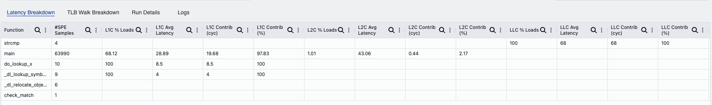
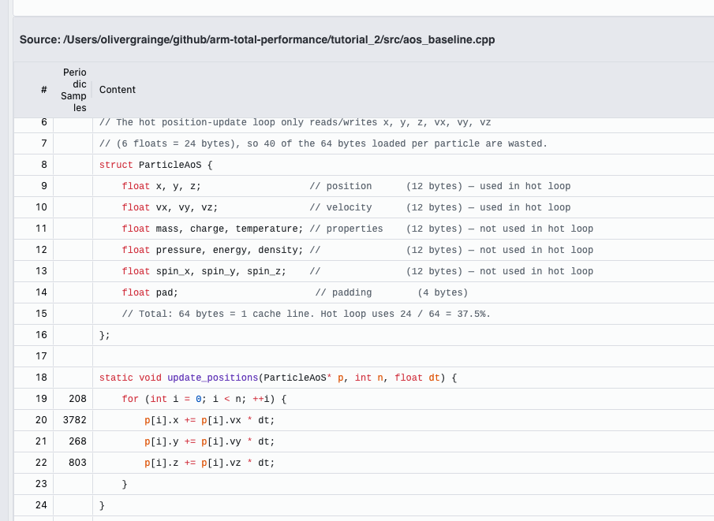
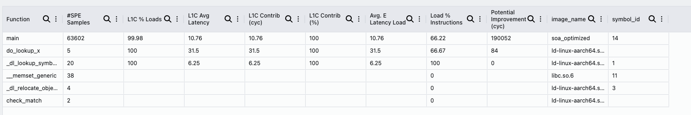
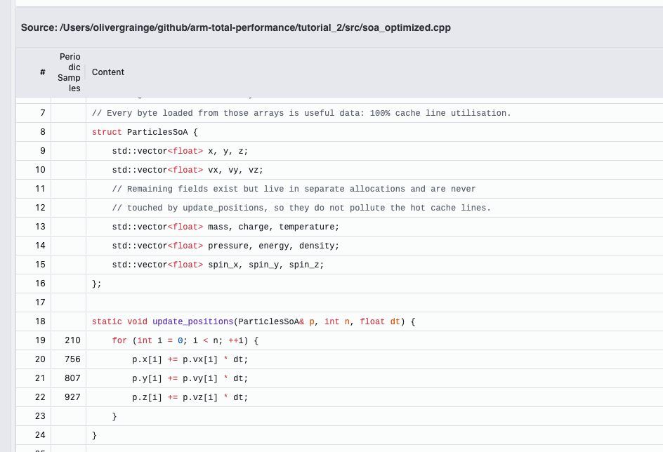

# Tutorial 2: Optimizing a Memory-Bound Workload with ATP — Memory Access + CPU Cycle Hotspots

In this tutorial you will use **Arm Total Performance (ATP)** to optimize a memory-bound C++ workload on **AWS (Amazon Web Services) Graviton**. You will profile the baseline with ATP's **Memory Access** and **CPU Cycle Hotspots** recipes, use the evidence to identify a data layout bottleneck, apply a source-level fix, and re-profile to verify the improvement.

The workflow follows a standard performance engineering loop:

1. Understand the workload
2. Profile the baseline with ATP Memory Access
3. Map the hotspot to source with ATP CPU Cycle Hotspots
4. Interpret the evidence — what is the bottleneck?
5. Apply a fix
6. Re-profile and verify

**Prerequisites:** AWS Graviton 2/3 instance, GCC 9+ or Clang 14+, CMake 3.16+, ATP installed and configured.

## Terms used in this tutorial

- **CPU**: central processing unit.
- **Cache line**: the minimum unit of data transferred between memory levels (64 bytes on Arm).
- **SPE**: Arm Statistical Profiling Extension, the hardware sampling mechanism used by the Memory Access recipe.
- **Periodic Samples**: ATP's sampled execution counts shown in CPU Cycle Hotspots tables.
- **L1C**: Level 1 data cache — the fastest and smallest cache, closest to the CPU core.
- **L2C**: Level 2 cache — larger and slower than L1C.

---

## 1. The workload

The program simulates a particle physics position update. Each iteration advances every particle's position using its velocity:

```cpp
p[i].x += p[i].vx * dt;
p[i].y += p[i].vy * dt;
p[i].z += p[i].vz * dt;
```

This runs over **1,048,576 particles** for **200 iterations**. The algorithm is simple — three multiply-adds per particle per iteration. There is no complex control flow, no branching, no dependencies between particles. On paper this loop should be entirely memory-bound and highly prefetcher-friendly.

The particle struct looks like this:

```cpp
struct ParticleAoS {
    float x, y, z;
    float vx, vy, vz;
    float mass, charge, temperature;
    float pressure, energy, density;
    float spin_x, spin_y, spin_z;
    float pad;
};  // 16 floats × 4 bytes = 64 bytes per particle
```

Each particle carries 16 fields, but the update loop only reads and writes six of them (`x`, `y`, `z`, `vx`, `vy`, `vz`). 

### Build and run

```bash
cd tutorial_2
mkdir -p build && cd build
cmake ..
make -j4
./aos_baseline
```

The binary prints a checksum. Record it — you will use it later to verify that any optimised version produces identical results.

---

## 2. Profile the baseline with Memory Access

With the workload running correctly, the first question is: **where is the time going?** Since this is a simple arithmetic loop over a large array, memory behaviour is the most likely factor. ATP's Memory Access recipe uses the Arm SPE hardware to sample loads and attribute them to cache tiers.

### Run the recipe

In ATP:

1. Open **Recipes**.
2. Select **Memory Access**.
3. Set the workload to launch `aos_baseline`.
4. Click **Run Recipe**.


*Memory Access recipe ready to run against `aos_baseline`.*

### Read the Latency Breakdown table

After the run completes, open the **Latency Breakdown** tab:

| Function | #SPE Samples | L1C % Loads | L1C Avg Latency | L1C Contrib (cyc) | L1C Contrib (%) | L2C % Loads | L2C Avg Latency | L2C Contrib (cyc) | L2C Contrib (%) |
|---|---:|---:|---:|---:|---:|---:|---:|---:|---:|
| main | 63,990 | 68.12 | 28.89 | 19.68 | 97.83 | 1.01 | 43.06 | 0.44 | 2.17 |

> **Note:** `update_positions` does not appear as a separate row because the compiler inlines it into `main`. All samples are attributed to `main`.


*AoS Latency Breakdown: 63,990 SPE samples on `main`, L1C % = 68.12%, L1C Avg Latency = 28.89 cycles.*

At this point, don't jump to conclusions — just note what the numbers say:

- **L1C % Loads = 68.12%** — only about two-thirds of sampled loads resolve in L1 cache. The rest miss to L2C or beyond.
- **L1C Avg Latency = 28.89 cycles** — this is high for L1C hits. A true L1C hit on Graviton is typically under 10 cycles. An average of ~29 cycles suggests many of these "L1C" accesses are actually stalling while lines are being refetched.
- **L2C Avg Latency = 43.06 cycles** — the ~1% of loads reaching L2C pay over 40 cycles each.

Something is wrong with how this loop interacts with the memory hierarchy. A simple stride-1 loop over contiguous data should have a much higher L1C hit rate. Let's look at the source code to understand why.

### Record the baseline numbers

Save these for comparison later:

- `#SPE Samples (main): 63,990`
- `L1C % Loads: 68.12%`
- `L1C Avg Latency: 28.89 cyc`
- `L2C % Loads: 1.01%`

---

## 3. Map the hotspot to source with CPU Cycle Hotspots

The Memory Access profile told us there is a memory problem, but not *which lines of code* are responsible. CPU Cycle Hotspots will map the cost to exact source locations.

### Run the recipe

In ATP:

1. Open **Recipes**.
2. Select **CPU Cycle Hotspots**.
3. Set the workload to launch `aos_baseline`.
4. Click **Run Recipe**.


### Open source code

In the **Functions** table, locate `main`, then double-click it (or right-click → **View Source Code**). If prompted, click **Specify Root Directory** and point to your local source tree.

Navigate to the `update_positions` function body (lines 19–22). ATP shows periodic sample counts on each line:

```
Line 19:    208  for (int i = 0; i < n; ++i) {
Line 20:  3,782      p[i].x += p[i].vx * dt;
Line 21:    268      p[i].y += p[i].vy * dt;
Line 22:    803      p[i].z += p[i].vz * dt;
```

Total on the loop body: **5,061 periodic samples**.


*Source Code Inspector (`aos_baseline.cpp`): the three position-update lines carry 3,782 + 268 + 803 = 4,853 samples, plus 208 on the loop control — 5,061 total.*

Two things stand out:

1. **The sample count is high overall** — 5,061 samples on three simple multiply-add lines.
2. **The distribution is heavily skewed** — line 20 (`p[i].x += ...`) accounts for 3,782 of the 5,061 samples. Lines 21 and 22 combined carry only about 1,071. Why would the `x` update be nearly 4× more expensive than `y` or `z`?

---

## 4. Diagnose the root cause

Now we have two pieces of evidence to connect:

- **Memory Access** shows a 68% L1C hit rate and ~29-cycle average L1C latency on a loop that should be fully prefetchable.
- **CPU Cycle Hotspots** shows the `x` update line carrying ~75% of all loop samples, far more than `y` or `z`.

The `x` field is at **offset 0** in the `ParticleAoS` struct. Since each struct is exactly 64 bytes — one cache line — the access to `p[i].x` is the access that triggers the full cache line load for that particle. The `y` and `z` fields at offsets 4 and 8 are already in the loaded line, so they resolve quickly. Line 20 is paying the memory latency for the entire struct, not just for `x`.

This leads to the core question: **what is in that 64-byte cache line?**

```
ParticleAoS: [x y z vx vy vz | mass charge temp | pressure energy density | spin_x spin_y spin_z pad]
             |<--- 24 bytes used --->|<------------------ 40 bytes wasted ------------------>|
             |<-------------------------------- 64 bytes loaded -------------------------------->|
```

Each cache line fetch loads 64 bytes, but the update loop only uses the first 24 bytes (the six position and velocity floats). The remaining 40 bytes — `mass`, `charge`, `temperature`, `pressure`, `energy`, `density`, `spin_*`, and padding — are loaded, occupy cache space, and are evicted without ever being read. This is **37.5% cache line utilisation** (24 / 64).

The consequences explain exactly what ATP reported:

- **Low L1C hit rate (68%)**: with 40 wasted bytes per cache line, the effective working set is 64 MB (1,048,576 × 64 bytes). That's larger than Graviton3's 32 MB L3 cache, meaning every iteration must pull most data from DRAM. It also means L1C is constantly being filled with data that will never be used, evicting useful data prematurely.
- **High L1C avg latency (29 cycles)**: the hardware prefetcher cannot keep up because it's fetching 2.67× more data than the loop actually needs (64 bytes per particle instead of 24).
- **Skewed sample distribution**: line 20 dominates because it triggers the cache line load. Lines 21–22 benefit from the data already being resident.

The diagnosis is clear: **the data layout is the bottleneck**. The struct packs hot and cold fields together, wasting cache bandwidth and cache capacity on data the hot loop never reads.

---

## 5. The fix — restructure from Array-of-Structures to Structure-of-Arrays

The fix is to separate hot fields from cold fields so that each cache line contains only data the loop actually uses. The standard approach is a **Structure-of-Arrays (SoA)** layout: instead of one struct per particle with all fields interleaved, you use one array per field so that all particles' values for a given field are contiguous in memory.

Open `src/soa_optimized.cpp`. The algorithm is identical — the only change is the data layout:

**Before (Array-of-Structures):** one struct per particle, all fields interleaved:

```cpp
struct ParticleAoS {
    float x, y, z;                   // used in hot loop
    float vx, vy, vz;                // used in hot loop
    float mass, charge, temperature; // not used — but loaded anyway
    float pressure, energy, density; // not used — but loaded anyway
    float spin_x, spin_y, spin_z;    // not used — but loaded anyway
    float pad;
};
std::vector<ParticleAoS> particles(N); // 64 MB working set
```

**After (Structure-of-Arrays):** one array per field, each field is contiguous:

```cpp
struct ParticlesSoA {
    std::vector<float> x, y, z;       // used in hot loop — 3 × 4 MB
    std::vector<float> vx, vy, vz;    // used in hot loop — 3 × 4 MB
    std::vector<float> mass, charge, temperature; // separate, never loaded
    std::vector<float> pressure, energy, density; // separate, never loaded
    std::vector<float> spin_x, spin_y, spin_z;    // separate, never loaded
};
```

Why this should fix the problem:

1. **Only hot arrays are loaded.** The update loop touches `x`, `y`, `z`, `vx`, `vy`, `vz` — six contiguous arrays totalling 6 × 4 MB = **24 MB**, down from 64 MB.
2. **100% cache line utilisation.** Each 64-byte line of `particles.x` contains 16 consecutive `x` values (16 × 4 bytes = 64 bytes), all consumed before eviction.
3. **No code changes beyond data access syntax.** The loop body changes from `p[i].x` to `p.x[i]` — the algorithm, iteration count, and arithmetic are identical.

Build and verify:

```bash
make -j4
./soa_optimized
```

Confirm the checksum matches the AoS baseline. The same computation on the same data must produce the same result.

---

## 6. Re-profile with Memory Access — verify the fix

Run the Memory Access recipe again, this time with `soa_optimized` as the workload.


*Memory Access recipe ready to run against `soa_optimized`.*

### Read the Latency Breakdown table

| Function | #SPE Samples | L1C % Loads | L1C Avg Latency | L1C Contrib (cyc) | L1C Contrib (%) | Potential Improvement (cyc) |
|---|---:|---:|---:|---:|---:|---:|
| main | 63,602 | 99.98 | 10.76 | 10.76 | 100 | 190,052 |


*SoA Latency Breakdown: L1C % = 99.98%, L1C Avg Latency = 10.76 cycles. All memory latency now comes from L1C — L2C and DRAM contributions are negligible.*

Compare against the baseline:

- **L1C % Loads: 68.12% → 99.98%** — virtually every load now resolves in L1C. The 24 MB working set fits in L3 and the hardware prefetcher can keep L1C continuously populated.
- **L1C Avg Latency: 28.89 → 10.76 cycles** — with no eviction pressure from unused data, loads resolve at true L1C speed.
- **L2C % Loads: 1.01% → ~0%** — L2C pressure is eliminated entirely.

The memory hierarchy is now behaving as expected for a simple stride-1 loop.

### Record the SoA numbers

- `#SPE Samples (main): 63,602`
- `L1C % Loads: 99.98%`
- `L1C Avg Latency: 10.76 cyc`
- `Potential Improvement: 190,052 cyc`

---

## 7. Re-map hotspot to source with CPU Cycle Hotspots — verify the fix

Run **CPU Cycle Hotspots** with `soa_optimized`. Open **View Source Code** for `main` and navigate to lines 19–22:

```
Line 19:  210  for (int i = 0; i < n; ++i) {
Line 20:  756      p.x[i] += p.vx[i] * dt;
Line 21:  807      p.y[i] += p.vy[i] * dt;
Line 22:  927      p.z[i] += p.vz[i] * dt;
```

Total on the loop body: **2,700 periodic samples**, down from 5,061 — a **47% reduction**.


*Source Code Inspector (`soa_optimized.cpp`): 756 + 807 + 927 = 2,490 samples on the update lines plus 210 on loop control — 2,700 total.*


Notice the second confirmation: **the distribution across lines is now even** (756, 807, 927). In the AoS profile, line 20 carried 75% of all samples because it triggered the per-struct cache line fetch. In SoA, each array is independent — no single line bears the cost of loading unrelated data. The skew has disappeared, which is exactly what the diagnosis in Section 4 predicted.

---

## 8. Summary of results

| Metric | `aos_baseline` | `soa_optimized` | Change |
|---|---:|---:|---|
| **L1C % Loads** | 68.12% | 99.98% | +31.86 pp |
| **L1C Avg Latency** | 28.89 cyc | 10.76 cyc | −63% |
| **L2C % Loads** | 1.01% | ~0% | Eliminated |
| **Hot loop periodic samples** | 5,061 | 2,700 | −47% |
| **Sample distribution (x / y / z)** | 3,782 / 268 / 803 | 756 / 807 / 927 | Skew eliminated |
| **Working set** | 64 MB | 24 MB | −62.5% |
| **Cache line utilisation** | 37.5% | 100% | +62.5 pp |
| **Algorithm change** | — | — | None |

The improvement came entirely from restructuring data, not from changing the algorithm, adding compiler hints, or rewriting the loop. ATP's two recipes provided the evidence at each step: Memory Access revealed the cache problem, CPU Cycle Hotspots pinpointed the source lines and confirmed the skew pattern that pointed to per-struct cache line fetches, and both recipes verified the fix after the change.

> **Note on Graviton vs other hardware.** The screenshots were taken on a development machine with a large L3 cache. On Graviton3 (32 MB L3), the 64 MB AoS working set exceeds L3, so the AoS profile will additionally show significant LLC and DRAM traffic — the improvement from SoA will be even more pronounced.


---

## Troubleshooting notes

- Keep `-g` enabled so ATP can resolve source locations to line numbers.
- Keep the problem size at `N = 1 << 20` and `iters = 200` for stable SPE sampling; smaller sizes may not produce enough samples for a reliable breakdown.
- Compare like-for-like runs: same Graviton instance, same CPU frequency policy, no other heavy workloads running concurrently.
- If `update_positions` does not appear as a separate function in ATP (shows only `main`), this is expected — the compiler inlines static functions. Click `main` and navigate to the `update_positions` body in the source view.
- If ATP does not resolve source lines at all (shows `??`), ensure you point the source root to the `tutorial_2/src` directory and verify debug symbols are present (`file aos_baseline` should show `with debug_info`).