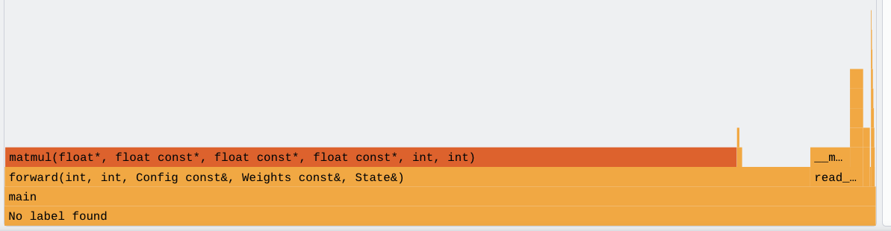
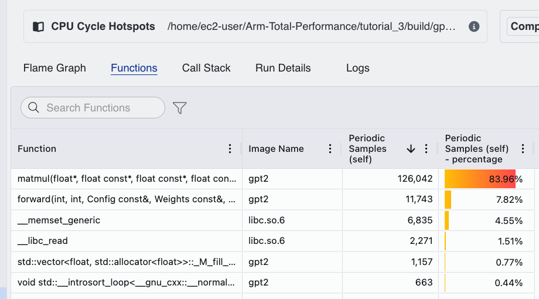
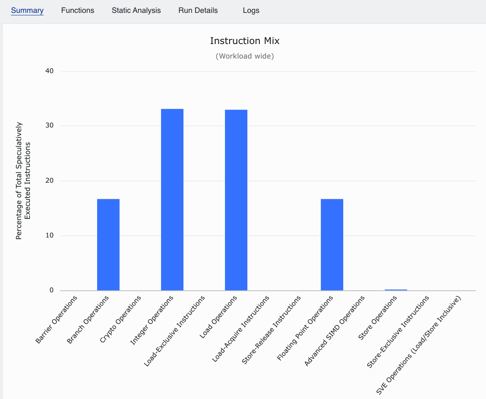
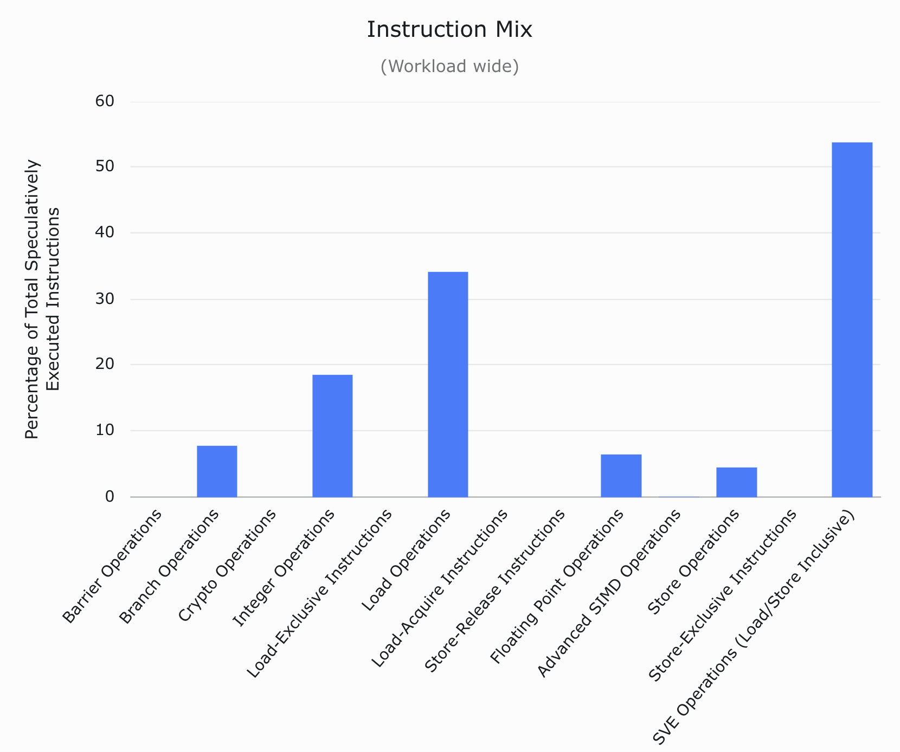
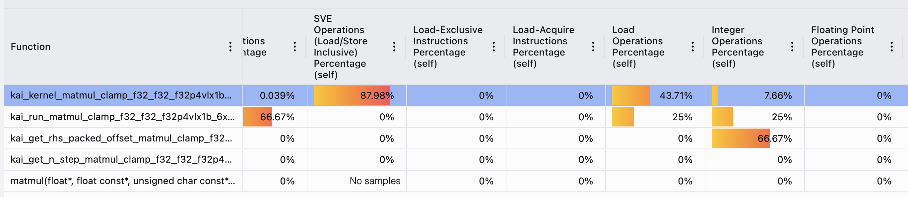

# Tutorial 3: Using ATP Instruction Mix to Optimise a C++ Workload

This tutorial shows you how to use **Arm Total Performance (ATP)** to optimise a real C++ LLM chatbot program. You will apply two ATP recipes - **CPU Cycle Hotspots** and **Instruction Mix** - in sequence. CPU Cycle Hotspots tells you which function is worth investigating. Instruction Mix tells you how that function is spending its time at the instruction level. Together they give you a concrete, evidence-based optimisation direction rather than a guess.

The workload is `gpt2`, a text-generation program that runs a medium-sized language model on the CPU. It is a realistic inference workload: compute-intensive, numerically dominated, and representative of the kind of code that benefits most from Arm's vector extensions. The tutorial follows the full loop a developer would use in practice: profile the workload, diagnose the bottleneck, apply a targeted fix, and re-profile to confirm the change worked. By the end of this tutorial, you will know how to:

1. Use CPU Cycle Hotspots to determine which function is worth investigating.
2. Use the Instruction Mix recipe to measure how instructions are distributed across scalar and vector units.
3. Use instruction-level evidence to decide whether a library-based implementation is likely to help.
4. Verify an optimisation by comparing instruction mix and throughput before and after.

## Before you begin

- An AWS Graviton3 instance (SVE is required for the optimised binary)
- GCC 11+ or Clang 14+
- CMake 3.16+
- Python 3.8+ with `pip`
- ATP installed and configured

## Background: Scalar versus Vector Arithmetic on Graviton3

Instruction mix matters because performance depends not just on how many instructions a program executes, but on what kind of instructions they are. On a floating-point workload, a loop that mainly uses scalar instructions will do less work per instruction than one using the CPU's vector units. That makes instruction mix a useful signal to investigate: it shows whether the hot code is actually using the hardware efficiently, or leaving throughput on the table.

ATP's **Instruction Mix** recipe counts every retired instruction and groups it by type: scalar integer, scalar FP, NEON, SVE, load/store, branch, and so on. For this tutorial, the most important categories are:

- **Scalar FP**: floating-point instructions operating on one value at a time. A simple non-vectorised C loop will often compile to this.
- **NEON**: Arm's 128-bit SIMD extension. For single-precision data, one instruction can operate on 4 floats at once.
- **SVE**: Arm's Scalable Vector Extension. On Graviton3, SVE is 256 bits wide, so one instruction can operate on 8 single-precision floats at once.

For a compute-heavy kernel, the balance between Scalar FP and SVE is a strong diagnostic signal. If the hot numerical loop is mostly scalar on a Graviton3 system, the processor's wider vector hardware is not being used well.


> **Note on measurement bias:** Because `matmul` accounts for ~85% of cycles in this workload, its instruction behaviour dominates the whole-program Instruction Mix ATP reports. The whole-program view is, in practice, a close proxy for what `matmul` is doing.

---

## The Workload

The program, `gpt2`, is a text generation engine. Given a short prompt, it generates new text one token at a time:

```text
$ ./gpt2 --model gpt2-medium "Once upon a time"
Once upon a time there was a man who had a great deal of money...
[200 tokens, 3.2 tok/s]
```

A **token** is a chunk of text processed by the model, often a whole word, part of a word, or punctuation. `tok/s` means **tokens per second**, which is the standard throughput metric for text generation: higher `tok/s` means the model is generating text faster.

Internally, GPT-2 Medium is a large numerical model with 345 million stored floating-point weights. These weights are the learned numerical parameters that determine how the model transforms one sequence of tokens into the next. Generating each new token requires running those weights through 24 layers of repeated arithmetic. Do not worry if you do not understand LLM internals; for this tutorial, the important point is that this is a compute-heavy C++ workload with several functions involved in the generation path. The next step is to download the model data and convert it into the binary format expected by the C++ program, then build and run the baseline workload.

### Build and Run

Export the model weights (requires an internet connection on the first run):

```bash
pip3 install torch transformers
python3 src/export_gpt2.py --model gpt2-medium
```

This downloads the GPT-2 Medium parameters and writes them into `models/gpt2-medium/weights.bin` and `models/gpt2-medium/vocab.bin`, the binary files used by the C++ program to run the text generation.

Next, build the C++ program:

```bash
cmake -S . -B build
cmake --build build --parallel
```

Run the baseline and record the throughput:

You can change the prompt `"Once upon a time"` if you want. The `-n` parameter sets the maximum number of tokens to generate.

```bash
cd build
./gpt2 --model gpt2-medium "Once upon a time" -n 50
```

When the program finishes generating, it prints a final line like this showing the generation throughput in tokens per second. Write it down; this is your baseline measurement. Next, you will use ATP to identify where the program spends its time so you can start improving its performance.

```text
[50 tokens, 17.2837 tok/s]
```

---

## Profile the Baseline: CPU Cycle Hotspots

The first question to ask about any workload is: where does the program actually spend its time? Without this, any optimisation attempt is just a guess. CPU Cycle Hotspots uses hardware performance counters to attribute cycles to individual functions as the program runs.

### Step 1: Run the recipe

Open ATP and select **Recipes -> CPU Cycle Hotspots**. Set the workload to launch `gpt2` with arguments `--model gpt2-medium "Once upon a time" -n 100`, then click **Run Recipe**.

### Step 2: Read the flame graph

When the run completes, select the **CPU Hotspots** result to view the **Flame Graph**. Each horizontal bar represents a function. Bars stacked on top of a function are routines it calls, so the graph shows the call stack from caller to callee. Width is proportional to the CPU time spent in that function and everything it calls. Wider bars near the bottom of the graph are the places the CPU is actually executing, so they are the candidates worth investigating.



The flame graph shows that most of the program's time is spent in `forward`, and most of that time is inside the `matmul` calls made by `forward`. Now, in the next step, let's quantify exactly how much time is spent where. 

### Step 3: Read the Functions table

In the CPU Hotspots run, switch to the **Functions** tab. Here, ATP lists every sampled function alongside its percentage of total cycles that it occupies:



The profile is clear: `matmul` accounts for about 84% of runtime. That means improving `matmul` should translate directly into higher throughput, but only up to a point: the other ~16% of the program still remains. Even if `matmul` were made infinitely fast, the total speedup would still be capped at about 6.25x.

**Your diagnosis so far:** `matmul` accounts for ~85% of cycles - the clear target. Now the question changes. We know *where* the time goes. The next question is: *how* is `matmul` spending it? Is the hardware being used effectively, or is there capacity being wasted?

---

## Profile the Baseline: Instruction Mix

ATP's Instruction Mix recipe answers this question directly. It counts every instruction that retires and classifies it by type. For this workload, the most important categories are Scalar FP and SVE. If the hot `matmul` loop emits scalar instructions, the CPU processes one float per instruction. If it emits SVE instructions, it can process 8 floats per instruction. The ratio between these categories is therefore a useful signal for whether the implementation is making good use of the processor's arithmetic hardware.

### Step 1: Run the recipe

In ATP, select **Recipes -> Instruction Mix**. Use the same workload and arguments - `gpt2 --model gpt2-medium "Once upon a time" -n 100` - then click **Run Recipe**.

### Step 2: Read the breakdown

ATP presents a workload-wide breakdown of retired instruction types. Because `matmul` accounts for about 85% of cycles, this chart is effectively showing you how `matmul` executes:



Two things stand out in the chart. First, the largest categories are **Integer** and **Load**. That is what you would expect from a scalar matrix multiply: every iteration must compute addresses and indices, then load `row[j]` and `x[j]` before doing the arithmetic. Second, **Advanced SIMD** and **SVE** are at 0%, so the compiler has not vectorised the dominant loop.

The other visible bars match the structure of a simple scalar matrix multiply:

- **Integer**: loop counters and address calculations (`i`, `j`, and `row`) generate a large number of integer instructions.
- **Loads**: each inner-loop iteration reads `row[j]` and `x[j]`, so scalar loads are also a large share of the mix.
- **Scalar FP**: each `acc += row[j] * x[j]` is a scalar floating-point multiply-accumulate, but it is only one part of the loop body.
- **Branch**: the `for` loop conditions (`j < n_in`, `i < n_out`) and the `b ?` ternary each produce branch instructions.
- **SVE / Advanced SIMD**: **0%**. No NEON or SVE instructions appear in the hot path.

This matches the scalar `matmul` implementation in `src/gpt2.cpp`:

```cpp
static void matmul(float *out, const float *x, const float *W, const float *b,
                   int n_in, int n_out) {
    for (int i = 0; i < n_out; i++) {
        float acc = b ? b[i] : 0.f;
        const float *row = W + (size_t)i * n_in;
        for (int j = 0; j < n_in; j++) acc += row[j] * x[j];
        out[i] = acc;
    }
}
```

The inner loop performs one scalar multiply-accumulate per iteration, surrounded by scalar loads and index arithmetic, which is exactly the execution pattern the Instruction Mix chart is showing.


**Complete diagnosis:** the hot `matmul` function is executing as a scalar loop with scalar loads, index logic, and scalar floating-point operations. `SVE = 0%`, so Graviton's vector units are idle for the dominant operation.

---

## Fix and Re-Profile: KleidiAI SVE Microkernel

ATP has identified the problem precisely: the dominant function is a scalar floating-point loop running on a processor with idle SVE vector units. The appropriate response is to replace that loop with an highly optimised implementation that uses vector units such as SVE.

To do this we can use KleidiAI is Arm's open-source library of AI computation microkernels, each hand-tuned to a specific CPU microarchitecture. The kernel used in `gpt2_kai_sve` - `kai_matmul_clamp_f32_f32_f32p4vlx1b_6x4vl_sve_mla` - is designed for Graviton. It processes a tile of 6 output rows and 4 SVE vector lengths of columns per inner loop iteration using fused multiply-accumulate (`FMLA`) instructions, keeping the SVE register file fully utilised throughout.

The change to the code involves two steps.

**Weight packing (once, at startup).** The microkernel expects the weight matrix in a specific tiled memory layout that allows it to load data efficiently. `gpt2_kai_sve` calls `pack_all_weights` before the first token is generated, which rearranges every projection matrix into this layout. This cost is paid once and is not included in the reported tok/s.

**Microkernel dispatch (every matmul call).** The scalar loop body is replaced by calls to `ukernel.run_matmul`, the KleidiAI kernel entry point. The function signature changes - weights are now passed as packed bytes rather than raw floats - but the inputs and outputs of every layer are identical.

The algorithm is unchanged. The model weights are unchanged. The generated text is the same. The only difference is what instructions the CPU executes to perform the multiplications.

### Step 1: Re-profile with Instruction Mix

Run the Instruction Mix recipe again, this time with `gpt2_kai_sve` as the workload. Always re-profile after a change and never assume your optimisation had the intended effect.

In ATP, select **Recipes -> Instruction Mix**, set the workload to `gpt2_kai_sve --model gpt2-medium "Once upon a time" -n 100`, and click **Run Recipe**.

### Step 2: Read the new Instruction Mix breakdown



| Instruction Category | `gpt2` | `gpt2_kai_sve` | Change |
|---|---:|---:|---|
| Loads | [your value] | [your value] | |
| Stores | [your value] | [your value] | |
| Integer | [your value] | [your value] | |
| Scalar FP | [your value] | [your value] | **large decrease** |
| Advanced SIMD (NEON) | [your value] | [your value] | |
| SVE | 0% | [your value] | **large increase** |
| Branch | [your value] | [your value] | |

The Scalar FP and SVE rows have inverted. The gap that the baseline profile revealed - SVE at zero despite a compute-heavy workload - has been closed. The Graviton3 SVE units are now active for the dominant function.

The modest increase in the Load percentage is a side-effect of the packed weight layout: the microkernel loads wider rows of weight data per inner loop iteration compared to the scalar row-by-row access, so a larger fraction of retired instructions are loads.

### Step 3: Re-profile with CPU Cycle Hotspots

A shift in the instruction mix should also be visible in how the cycle distribution across functions changes. Run CPU Cycle Hotspots one more time with `gpt2_kai_sve`: select **Recipes -> CPU Cycle Hotspots**, set the same workload and arguments, and click **Run Recipe**.



| Function | % Cycles (`gpt2`) | % Cycles (`gpt2_kai_sve`) |
|---|---:|---:|
| `matmul` (scalar wrapper) | ~85% | small |
| `kai_run_matmul_...` (SVE kernel) | - | [your value, dominant] |
| `layernorm` | ~6% | [your value, larger relative share] |
| Attention loops | ~5% | [your value, larger relative share] |
| Other | ~4% | [your value] |

The dominant function has changed from the hand-written scalar loop to the KleidiAI microkernel - exactly what a successful library substitution looks like in ATP. The `layernorm` and attention loop functions appear to occupy a larger relative share than before. They have not become slower; the matmul has become faster, so those functions now represent a larger fraction of what remains. This is a useful signal: the bottleneck has shifted, and if further improvement is needed, ATP is already pointing at the next target.

---

## Verify with Throughput

Compare the tok/s figures from both runs:

| Binary | Throughput | SVE % | Scalar FP % |
|---|---:|---:|---:|
| `gpt2` | [X tok/s] | 0% | [your value] |
| `gpt2_kai_sve` | [Y tok/s] | [your value] | [your value] |
| Improvement | [Y/X ×] | - | - |

The throughput increase is the real-world consequence of the instruction-level change ATP measured. No algorithm changed, no data was restructured, no compiler flags were added. The improvement comes entirely from replacing scalar FP instructions with SVE FP instructions in the one function that dominates the runtime.

---

## Key Takeaways

**Follow the profile-diagnose-fix-re-profile loop.** The pattern in this tutorial is the same one you will use on any workload: profile to find the hotspot, use Instruction Mix to understand what the hotspot is executing, apply a targeted fix, and re-profile to confirm the change worked. ATP provided the diagnostic at each step: CPU Cycle Hotspots answered "where?", and Instruction Mix answered "how?".

**Backend utilisation is visible in the instruction mix.** Knowing that `matmul` is the hotspot is not enough. The Instruction Mix showed that the hotspot was executing scalar FP instructions on a processor with idle SVE vector units - that combination is a concrete, actionable diagnosis rather than a guess.

**SVE = 0% after adopting an SVE library means something is wrong.** If you integrate a library that claims to use SVE and the Instruction Mix still shows SVE = 0% afterwards, something has gone wrong - the wrong build was linked, a scalar fallback path is being taken, or the inputs do not meet the kernel's requirements. ATP makes that situation immediately visible without needing to inspect assembly or read library documentation.

**Always re-profile after each change.** The re-profile confirmed that the instruction mix shift translated into real throughput improvement. The `layernorm` and attention functions now occupy a larger relative share of the profile - not because they got slower, but because the bottleneck moved. If further improvement is needed, ATP is already pointing at the next target.

---

## Troubleshooting

- `gpt2_kai_sve` only builds on AArch64 hosts. CMake skips the target silently on other architectures; check the CMake output if the binary is missing.
- If Instruction Mix shows SVE = 0% for `gpt2_kai_sve`, verify the binary targets `aarch64` and the instance is Graviton3. SVE is not available on Graviton2, which provides NEON only.
- Keep `-g` in the build flags (already set in `CMakeLists.txt`) so ATP can resolve function names and source lines.
- Use the same `-n` token count for both profiled runs to ensure a fair comparison.
- If `matmul` does not appear as a separate row in the Functions table (only `forward` is visible), the compiler has inlined it. Click `forward` and use the Source Code view; the sample counts on the call-site lines reflect the matmul cost.
- The weight packing step in `gpt2_kai_sve` runs before generation begins. In the flame graph it appears as a short bar at the very start of execution. ATP's time-range selector can isolate the generation phase if packing is visible in the profile.
