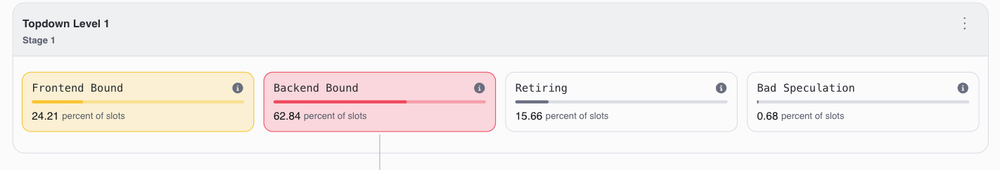
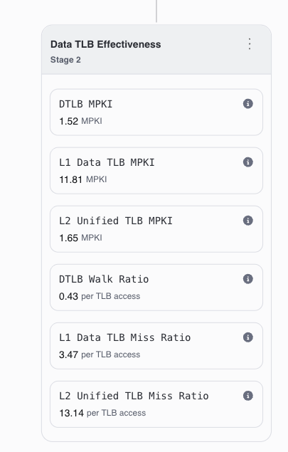
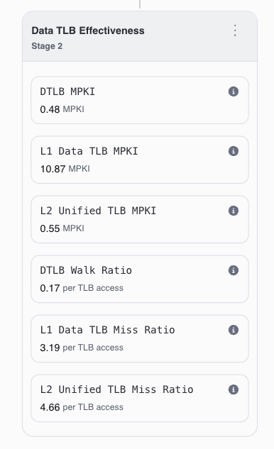

# Tutorial 6: Capstone — Optimising a CLIP Image Search Application with Arm Total Performance

In the previous tutorials you profiled small programs to learn individual ATP recipes. This final tutorial brings everything together: you will speed up a **real application** — a text-to-image search engine that uses [pgvector](https://github.com/pgvector/pgvector), a plugin for the PostgreSQL database.

## What the application does

The application lets you type a text description — "a red sports car", "a cute puppy" — and instantly find the most visually matching images from a database of 50,000 photographs.

<p align="center">

</p>

### How it works

The key idea is **vector search**. An AI model called [CLIP](https://openai.com/research/clip) turns every image into a list of 512 numbers. This list of numbers is called a **vector**. CLIP also turns the text you type into a vector. When an image closely matches your text, their vectors will have similar numbers.

To find the best match, we compare vectors by looking at how different they are — we subtract each pair of numbers and add up the differences. The smaller the total difference, the better the match.

But with 50,000 images, comparing against every single one would be slow. Instead, the application uses [pgvector](https://github.com/pgvector/pgvector) — a plugin for the PostgreSQL database that is designed for this kind of search. pgvector organises the vectors into a smart structure called an **HNSW index**. Think of it like a web where similar images are linked together. Instead of checking all 50,000 images, a search starts at one point in the web and hops along the links, quickly narrowing down to the closest matches.

### Architecture

The application has two layers:

**Dashboard (Python + Gradio)** — the part you interact with. It takes the text you type, converts it into a vector using CLIP, and asks the database to find matching images.

**PostgreSQL + pgvector** — the search engine. It stores all 50,000 image vectors and finds the closest matches when asked. This is the part where performance matters most.

A single search returns in milliseconds. But when the system needs to handle **thousands of searches** — imagine many users searching at the same time — every bit of slowness adds up. That is the workload you will profile and speed up.

## Before you begin

- An **AWS Graviton 2/3** instance (e.g. `m7g.xlarge` or larger)
- **PostgreSQL 14+** with **pgvector** extension
- **Python 3.8+** with pip
- **ATP** installed and configured

Install the required Python packages:

```bash
pip install torch open-clip-torch Pillow numpy gradio psycopg2-binary
```

Install PostgreSQL and its development headers (needed to build the pgvector extension from source):

```bash
sudo dnf install -y postgresql16-server postgresql16-server-devel postgresql16-contrib
```

## Terms used in this tutorial

| Term | What it means |
|------|---------------|
| **Page** | The operating system splits memory into small, equal-sized chunks called "pages". By default each page is 4 KB — a very small piece of memory. |
| **Huge Pages** | A Linux feature that uses much bigger memory chunks (2 MB instead of 4 KB). This helps the CPU manage large amounts of memory more efficiently, as explained in Step 5. |
| **TLB** | Translation Lookaside Buffer — a tiny, fast lookup table built into the CPU. It remembers where recently used memory pages are stored. Think of it like a short contacts list on your phone — it is quick to check, but can only hold a limited number of entries. When the page you need is not in the list (a "TLB miss"), the CPU has to do a much slower search to find it. |
| **shared_buffers** | PostgreSQL's own memory area for storing data it uses frequently. This is where your image vectors live in memory. |

---

## Step 1: Set up PostgreSQL and pgvector

PostgreSQL is the database that will store the 50,000 image vectors and answer search queries. pgvector is an extension that adds vector search capabilities to PostgreSQL — without it, PostgreSQL has no way to efficiently compare and rank vectors. It is not available as a pre-built package, so it needs to be compiled from source and installed into your PostgreSQL installation.

### Initialise and start PostgreSQL

Before PostgreSQL can be used for the first time, its on-disk storage (the "database cluster") needs to be initialised. This creates the system tables and configuration files that every PostgreSQL instance requires. You only need to do this once.

```bash
sudo postgresql-setup --initdb
sudo systemctl start postgresql
sudo systemctl enable postgresql
```

The `enable` command ensures PostgreSQL starts automatically if the instance is rebooted.

### Create a superuser for your Linux account

By default, PostgreSQL only has a built-in `postgres` user. Creating a superuser that matches your Linux username lets you run `psql` and other database commands without having to switch to the `postgres` account each time.

```bash
sudo -u postgres createuser --superuser $USER
```

### Build and install pgvector

pgvector is compiled against the PostgreSQL development headers that were installed in the "Before you begin" step. The build process produces a shared library and SQL files that PostgreSQL loads when you enable the extension in a database.

```bash
git clone --branch v0.8.0 https://github.com/pgvector/pgvector.git
cd pgvector
make PG_CONFIG=/usr/bin/pg_config
sudo make install PG_CONFIG=/usr/bin/pg_config
cd .. && rm -rf pgvector
```

---

## Step 2: Set up the data

### Generate CLIP embeddings and load into pgvector

```bash
python3 scripts/setup_data.py
```

This script:
1. Downloads a dataset of 50,000 small photographs called **CIFAR-100** (~170 MB)
2. Uses the **CLIP** AI model to convert each image into a vector (a list of 512 numbers)
3. Creates a PostgreSQL database called `clip_search`
4. Loads all 50,000 image vectors into the database and builds the HNSW search index
5. Saves the images and some pre-made query vectors locally for the dashboard and benchmark

This may take around 5 minutes depending on your instance.

You can verify the database is set up correctly:

```bash
psql clip_search -c "SELECT COUNT(*) FROM images;"
```

You should see `50000`.

---

## Step 3: Try the dashboard

Start the dashboard:

```bash
python3 dashboard/app.py
```

Open `http://localhost:7860` in your browser.

> **Connecting remotely?** If the instance is not your local machine, you will need SSH port forwarding so your browser can reach the dashboard. Add the `-L` flag when connecting:
> ```bash
> ssh -L 7860:localhost:7860 user@<your-instance-ip>
> ```
> Then open `http://localhost:7860` in your local browser as normal. Type a description — "a red sports car", "sunset over the ocean", "a cute puppy" — and the dashboard returns the 10 most similar images from the database.

<p align="center">

</p>

The search feels instant for a single query. But behind the scenes, the database is searching through 50,000 vectors. When many users search at the same time, the database needs to handle thousands of these searches efficiently. The rest of this tutorial focuses on making that faster.

---

## Step 4: Run the baseline benchmark

The benchmark script runs 10,000 image searches against the database and measures how fast they complete:

```bash
python3 scripts/benchmark.py
```

Expected output (timings vary by instance):

```
Loaded 10000 query embeddings (dim=512)

Benchmark: 10000 queries, k=10, ef_search=200
Database:  clip_search

    1000 / 10000  (436.2 queries/sec)
    2000 / 10000  (439.8 queries/sec)
    3000 / 10000  (441.5 queries/sec)
    4000 / 10000  (441.8 queries/sec)
    5000 / 10000  (441.7 queries/sec)
    6000 / 10000  (442.6 queries/sec)
    7000 / 10000  (443.1 queries/sec)
    8000 / 10000  (442.7 queries/sec)
    9000 / 10000  (443.2 queries/sec)
   10000 / 10000  (443.4 queries/sec)

=============================================
  Total time:     22.55 s
  Throughput:     443.4 queries/sec
  Avg latency:    2.26 ms/query
  Queries:        10000
  ef_search:      200
=============================================
```

Write down this number (queries per second). You will compare it against the improved version later.

---

## Step 5: Profile the baseline with ATP

While the benchmark runs, PostgreSQL is doing all the heavy lifting: its worker process is jumping around the HNSW index, comparing vectors, and reading data from memory. This is the process you will profile with ATP.

### Record the workload with ATP

Start the benchmark in one terminal:

```bash
python3 scripts/benchmark.py
```

In ATP, select **Attach to Process** and choose the `postgres` backend process connected to the `clip_search` database. Start recording and let it capture for at least 30 seconds while the benchmark runs.

### Analyse with Topdown

Once the capture completes, select the **Topdown** recipe to see where the CPU is spending its time.

Look at the four categories in the Topdown summary:

<p align="center">

</p>

You should see that **Backend Bound** takes up a large portion, with **Memory Bound** being the biggest part of it. What this tells you: the CPU is spending a lot of its time *waiting for data to arrive from memory* instead of doing useful work.

### Drill into memory: understanding the slowdown

Now select the **Memory Access** recipe in ATP. Look at three key numbers:

- **DTLB walk cycles** — how much time the CPU wastes searching for memory locations when its quick lookup table (the TLB) does not have the answer
- **L1D cache hit rate** — how often the CPU finds the data it needs in its fastest storage
- **Average load latency** — how long each memory read takes on average

<p align="center">

</p>

The most important finding is that **DTLB walk cycles are high**. Here is what that means:

#### The contacts list analogy

Imagine your phone has a contacts list that can only hold 48 entries. Every time you need to call someone who is not on the list, you have to dig through a huge filing cabinet to find their number — which is much slower.

The CPU has the same problem. It keeps a small, fast lookup table called the **TLB** that remembers where recently used memory pages are stored. This table can only hold about 48 entries.

Now here is the issue:

- PostgreSQL stores all the image vectors and their connections (about 100 MB of data) in memory.
- With the default settings, this memory is split into tiny **4 KB chunks** (pages). That means about **25,000 separate pages** to cover 100 MB.
- The TLB can only remember the locations of **48 pages** at a time.
- When searching through the HNSW index, PostgreSQL jumps between vectors that are spread all over memory. Each jump usually lands on a *different* page.

Since the TLB can only track 48 pages but the search needs to access thousands of different pages, it constantly runs out of space. Every time this happens (a "TLB miss"), the CPU has to do a slow search to find the right memory location — like digging through that filing cabinet instead of checking your contacts list.

#### What this means

The CPU is slow because of **memory lookups, specifically TLB misses**. The search jumps around ~100 MB of data, which is split into too many tiny pages for the TLB to keep track of. The fix: use **huge pages** (2 MB each instead of 4 KB). Each huge page covers 512 times more memory, so the TLB can track the entire data region without running out of space.

---

## Step 6: Optimisation 1 — PostgreSQL memory tuning

ATP showed us the CPU is **waiting on memory** too much, specifically because of TLB misses when searching the index. The main fix is huge pages (Step 7), but huge pages only work on memory that PostgreSQL controls directly — its `shared_buffers` area. If the index data does not fit in `shared_buffers`, PostgreSQL reads it through the operating system instead, where huge pages have no effect. So the first step is making `shared_buffers` big enough to hold all the index data.

### Check current settings

```bash
psql clip_search -c "SHOW shared_buffers;"
psql clip_search -c "SHOW work_mem;"
```

The defaults are typically:
- `shared_buffers = 128MB`
- `work_mem = 4MB`

### Tune PostgreSQL memory

Edit the PostgreSQL configuration:

```bash
sudo nano /var/lib/pgsql/data/postgresql.conf
```

Set these three values:

```
shared_buffers = 512MB
work_mem = 128MB
maintenance_work_mem = 256MB
```

**What each setting does and why we are changing it:**

#### `shared_buffers`: 128 MB → 512 MB

This is PostgreSQL's own memory area where it keeps data it uses frequently. This is the most important setting for our performance problem.

The image vectors and their index take up about 100 MB. With the default 128 MB, there is barely enough room, so PostgreSQL keeps having to swap data in and out. At 512 MB, everything fits comfortably.

**Why this matters:** In Step 7, we will turn on huge pages for this memory area. Huge pages only apply to `shared_buffers` — not to other memory. By making sure all the index data fits inside `shared_buffers`, we guarantee that every search operation benefits from huge pages, which is what will fix the TLB problem ATP found.

#### `work_mem`: 4 MB → 128 MB

This controls how much memory each individual search query can use for temporary work (like sorting results). With only 4 MB, large searches may have to write temporary data to disk, which is slow. At 128 MB, searches can stay entirely in memory.

#### `maintenance_work_mem`: 64 MB → 256 MB

Memory used for housekeeping tasks like rebuilding indexes. A larger value speeds up index rebuilds if you need to re-create the index later.

### Apply and restart

Restart PostgreSQL to apply changes:

```bash
sudo systemctl restart postgresql
```

### Re-benchmark

```bash
python3 scripts/benchmark.py
```

You should see some improvement in speed. The larger `shared_buffers` keeps all the index data in PostgreSQL's own memory, which is faster to access. But the underlying TLB problem is still there — the memory is still divided into tiny 4 KB pages. That is what Step 7 fixes.

---

## Step 7: Optimisation 2 — Huge pages

This is the most important change, directly fixing the TLB problem that ATP found.

### Why huge pages fix the problem

Remember the contacts list analogy from Step 5. The TLB can only hold about 48 entries at a time.

**With the default small pages (4 KB):**

- 512 MB of memory = **131,072 pages** the CPU needs to keep track of
- The TLB can only remember **48** at a time
- Result: the TLB constantly runs out of space, causing slow lookups over and over

**With huge pages (2 MB):**

- 512 MB of memory = only **256 pages** to keep track of
- The TLB can remember **48** at a time — that covers almost all of them
- Result: the TLB almost never runs out of space, so the CPU can focus on the actual work

### Step 7a: Reserve huge pages

The operating system needs to set aside these large memory pages in advance. We need enough for PostgreSQL's `shared_buffers` (512 MB) plus a small extra amount:

```bash
# 512 MB / 2 MB = 256 pages, plus ~24 for PostgreSQL internals
echo 280 | sudo tee /proc/sys/vm/nr_hugepages
```

Check that the pages were reserved:

```bash
cat /proc/meminfo | grep HugePages
```

You should see `HugePages_Total: 280` and `HugePages_Free: 280` (or close to it).

### Step 7b: Tell PostgreSQL to use huge pages

Edit the configuration:

```bash
sudo nano /var/lib/pgsql/data/postgresql.conf
```

Add this line:

```
huge_pages = on
```

Restart PostgreSQL:

```bash
sudo systemctl restart postgresql
```

> **Troubleshooting:** If PostgreSQL fails to start, it means it could not get enough huge pages. This usually happens when the system's memory is too fragmented to carve out large 2 MB blocks. Try increasing the `nr_hugepages` number or free up memory by stopping other programs. You can check the error logs with `sudo journalctl -u postgresql`.

### Re-benchmark

```bash
python3 scripts/benchmark.py
```

You should see a clear improvement in speed. Because each huge page covers so much more memory, the TLB can now keep track of almost everything without running out of space. The CPU spends less time hunting for memory locations and more time doing the actual search work.

---

## Step 8: Re-profile with ATP — confirming the fix

Now repeat what you did in Step 5: run the benchmark, attach ATP to the postgres process, and capture a new recording. This lets you see whether the changes actually helped.

### Topdown comparison

<p align="center">

</p>

| Category      | Before   | After Huge Pages | What this means |
|---------------|----------|------------------|-----------------|
| Backend Bound | High     | Lower            | Less time waiting for memory |
| Retiring      | Low      | Higher           | More time doing useful work |

You should see that **Backend Bound** has gone down and **Retiring** has gone up. This means the CPU is now spending more of its time on actual useful work (comparing vectors, searching the index) and less time stuck waiting for memory lookups.

### Memory Access comparison

<p align="center">

</p>

| Metric             | Before    | After Huge Pages | What changed |
|--------------------|-----------|------------------|--------------|
| DTLB walk cycles   | High      | Much lower       | The TLB can now keep track of the data — far fewer slow lookups needed |
| L1D hit rate       | ~85-90%   | ~92-97%          | The CPU's fast storage is working more effectively |
| Avg load latency   | Higher    | Lower            | Each memory read completes faster |

This confirms what we found in Step 5: the TLB was the bottleneck, and huge pages fixed it.

---

## Summary

You started with a text-to-image search application — 50,000 images in a pgvector database — and used ATP to find and fix a performance problem:

| Step | What you did | What ATP showed |
|------|-------------|-----------------|
| **Baseline** | Default PostgreSQL settings, small 4 KB pages | CPU is slow because it keeps wasting time looking up memory locations (TLB misses) |
| **Memory tuning** | Made `shared_buffers` bigger (512 MB) | Keeps all the data in PostgreSQL's own memory (some improvement, but TLB problem remains) |
| **Huge pages** | Switched to large 2 MB pages | TLB can now keep track of the data — slow lookups almost disappear |

The process followed the same loop as the earlier tutorials: **profile -> find the problem -> fix it -> profile again to confirm**. The difference is that this time the fix was not in the application code but in **system and database settings** — a common situation when running real workloads on Arm.

### File reference

| File | Description |
|------|-------------|
| `scripts/setup_data.py` | Downloads images, creates vectors with CLIP, loads them into the database |
| `scripts/benchmark.py` | Runs 10,000 search queries and measures speed |
| `dashboard/app.py` | Interactive web interface for text-to-image search |

### Key takeaway

Not all performance problems are in the code. When you run applications on Arm — especially databases with large amounts of data in memory — system-level settings like huge pages can make a big difference in speed. ATP's Memory Access recipe gives you the evidence to find these problems and confirm that your changes actually worked.
