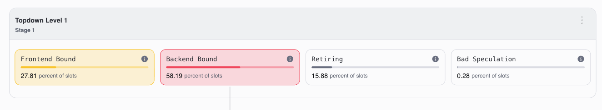

# Tutorial 7: Profiling and Optimising Redis on Arm with ATP

Redis is one of the most widely used in-memory data stores. It powers caches, session stores, and real-time analytics in applications around the world. Because all data lives in memory and a single thread handles every request, Redis performance depends heavily on how efficiently the CPU can access memory.

In this tutorial you will load a large dataset into Redis, benchmark it, use ATP to identify the bottleneck, and apply kernel-level optimisations to improve throughput.

## How Redis works (the short version)

Redis stores all data in memory as key-value pairs. When a client asks for a key, Redis:

1. **Hashes** the key name to find which bucket it belongs to
2. **Looks up** the bucket in a large hash table spread across memory
3. **Reads** the value data from wherever it is stored in memory
4. **Sends** the result back to the client

With a small dataset this is extremely fast — everything fits in the CPU's caches. But when the dataset grows to hundreds of megabytes or more, the hash table and values are spread across many memory pages. Random lookups start hitting memory that is not in the cache, and the CPU spends more time waiting for data than doing useful work.

## Before you begin

- An **AWS Graviton 2/3** instance (e.g. `m7g.xlarge` with 4+ GB RAM)
- **ATP** installed and configured
- **Redis** (installed in Step 1)

## Terms used in this tutorial

| Term | What it means |
|------|---------------|
| **Page** | The operating system splits memory into small, equal-sized chunks called "pages". By default each page is 4 KB. |
| **Huge Pages** | A Linux feature that uses much bigger memory chunks (2 MB instead of 4 KB). Fewer pages means the CPU can keep track of more memory in its fast lookup table. |
| **TLB** | Translation Lookaside Buffer — a small, fast lookup table in the CPU that remembers where recently used memory pages are stored. When the page you need is not in the TLB (a "TLB miss"), the CPU has to do a much slower search called a "page table walk". |
| **THP** | Transparent Huge Pages — a Linux kernel feature that automatically uses huge pages without the application needing to request them explicitly. |
| **Pipelining** | Sending multiple Redis commands in a batch without waiting for each response. This reduces network round trips and makes the benchmark focus on memory access rather than networking. |

---

## Step 1: Install and configure Redis

### Install Redis

```bash
sudo dnf install -y redis
```

### Configure Redis for benchmarking

Edit the Redis configuration to disable persistence (we do not need to save data to disk, and persistence uses `fork()` which interacts badly with huge pages):

```bash
sudo nano /etc/redis/redis.conf
```

Find and set these values:

```
save ""
appendonly no
```

This disables both RDB snapshots and the append-only file. Redis will only keep data in memory.

### Start Redis

```bash
sudo systemctl start redis
sudo systemctl enable redis
```

Verify it is running:

```bash
redis-cli ping
```

You should see `PONG`.

---

## Step 2: Load data

The load script uses `redis-benchmark` to populate Redis with approximately 1 million unique keys, each with a 1 KB value. This creates a dataset of roughly 1 GB in memory — large enough to put pressure on the CPU's memory system.

```bash
bash scripts/load_data.sh
```

Expected output:

```
Loading data into Redis...
Creating ~1M keys with 1KB values (~1GB in memory)

SET: XXX requests per second ...

Redis memory usage:
used_memory_human:~1.0G
```

You can verify the dataset size:

```bash
redis-cli info memory | grep used_memory_human
redis-cli dbsize
```

---

## Step 3: Run the baseline benchmark

Before making any changes, measure the current performance. The benchmark script runs 5 million random GET operations with pipelining enabled, which maximises throughput and ensures the bottleneck is memory access rather than network overhead:

```bash
bash scripts/run_benchmark.sh
```

Write down the **requests per second** number. This is your baseline.

---

## Step 4: Profile the baseline with ATP

### Start the workload

Run the infinite benchmark in one terminal:

```bash
bash scripts/run_benchmark_inf.sh
```

The script prints the Redis server PID on startup.

### Attach ATP to the Redis process

> **Important:** Attach ATP to the **redis-server** process, not the redis-benchmark client. The server is where all the data access happens.

Find the PID:

```bash
ps aux | grep redis-server
```

In ATP, select **Attach to Process** and enter the PID of the `redis-server` process. Start recording and let it capture for at least 30 seconds while the benchmark runs.

### Analyse with Topdown

Once the capture completes, select the **Topdown** recipe.

<p align="center">

</p>

You should see that **Backend Bound** is elevated, with **Memory Bound** as a significant component. This tells you the CPU is spending a lot of time waiting for data to arrive from memory.

### Analyse with Memory Access

Now select the **Memory Access** recipe. Look at:

- **DTLB walk cycles** — time spent on page table walks when the TLB misses
- **L1D cache hit rate** — how often data is found in the fastest cache
- **Average load latency** — how long each memory read takes

<p align="center">

</p>

With ~1 GB of data spread across roughly **250,000 small pages** (4 KB each), and the TLB only able to track about **48 pages** at a time, random key lookups cause frequent TLB misses. Each miss triggers a slow page table walk.

---

## Step 5: Optimisation — Transparent Huge Pages

### Why huge pages help

With the default 4 KB pages:

- 1 GB of data = **~250,000 pages**
- The TLB can remember **~48** at a time
- Random lookups constantly miss the TLB → slow page table walks

With 2 MB huge pages:

- 1 GB of data = **~512 pages**
- The TLB can cover a much larger portion of memory
- Far fewer TLB misses → faster memory access

### Enable Transparent Huge Pages

Check the current setting:

```bash
cat /sys/kernel/mm/transparent_hugepage/enabled
```

If it shows `[never]` or `[madvise]`, huge pages are not being used for Redis. Enable them:

```bash
echo always | sudo tee /sys/kernel/mm/transparent_hugepage/enabled
```

> **Note:** Redis normally warns against Transparent Huge Pages because they can cause high memory usage when Redis forks for persistence (RDB/AOF saves). Since we disabled persistence in Step 1, this is not a concern — there are no forks, so huge pages are safe and beneficial.

### Restart Redis and reload data

Restart Redis so it allocates memory with the new huge pages setting:

```bash
sudo systemctl restart redis
bash scripts/load_data.sh
```

### Re-benchmark

```bash
bash scripts/run_benchmark.sh
```

Compare this number with your baseline. You should see improved throughput.

---

## Step 6: Re-profile with ATP — confirming the fix

Repeat the profiling from Step 4: run the infinite benchmark, attach ATP to the redis-server process, and capture a new recording.

### Topdown comparison

<p align="center">

</p>

| Category      | Before       | After Huge Pages | What this means |
|---------------|--------------|------------------|-----------------|
| Backend Bound | High         | Lower            | Less time waiting for memory |
| Retiring      | Lower        | Higher           | More time doing useful work |

### Memory Access comparison

<p align="center">

</p>

| Metric             | Before    | After Huge Pages | What changed |
|--------------------|-----------|------------------|--------------|
| DTLB walk cycles   | High      | Much lower       | TLB can cover the dataset — fewer slow page table walks |
| Avg load latency   | Higher    | Lower            | Each memory read completes faster |

---

## Summary

You loaded a 1 GB dataset into Redis and used ATP to find and fix a performance problem:

| Step | What you did | What you learned |
|------|-------------|------------------|
| **Baseline** | ~1M keys with 1 KB values, default 4 KB pages | Redis is **Backend Bound** — the CPU waits for memory due to TLB misses on ~250,000 small pages |
| **Huge pages** | Enabled Transparent Huge Pages (2 MB pages) | TLB can cover the dataset with far fewer entries — page table walks drop, throughput improves |

### Why this matters

Redis is single-threaded — it cannot speed up by using more CPU cores. When the dataset is large, the only way to go faster is to make each memory access more efficient. Huge pages do exactly this by reducing the overhead of translating memory addresses.

This is a common pattern for in-memory workloads on Arm: the application code is already efficient, but the **operating system's memory configuration** is the bottleneck. ATP's Memory Access recipe gives you the evidence to find these problems and confirm that your changes worked.

### File reference

| File | Description |
|------|-------------|
| `scripts/load_data.sh` | Populates Redis with ~1M keys (~1GB) |
| `scripts/run_benchmark.sh` | Runs a fixed GET benchmark and reports throughput |
| `scripts/run_benchmark_inf.sh` | Infinite benchmark loop for attaching a profiler |
